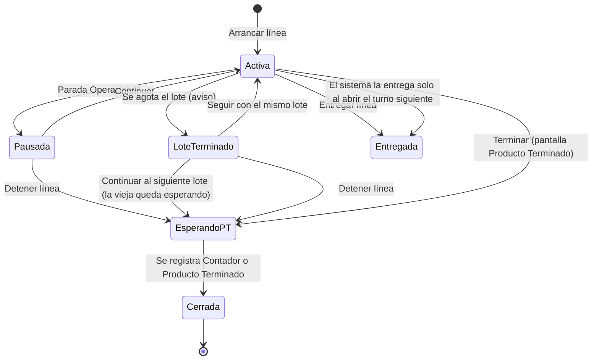
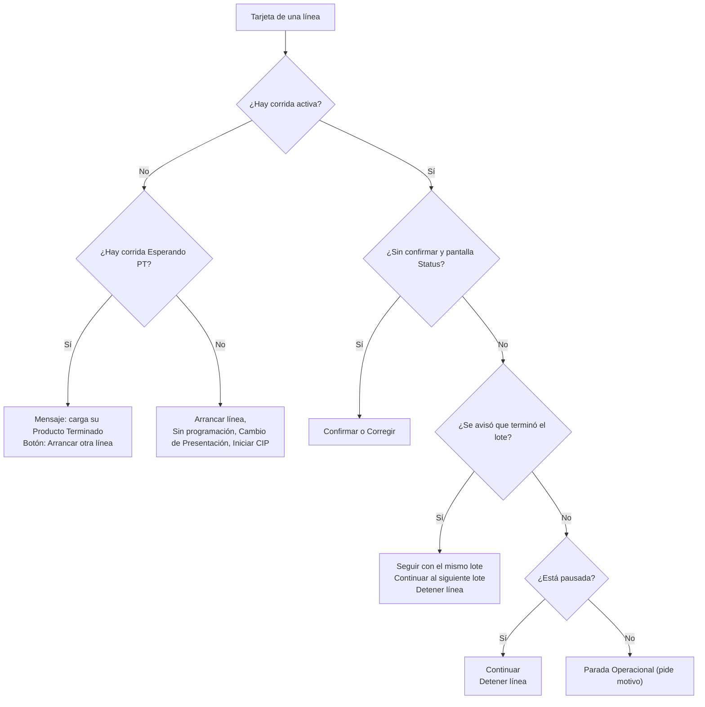
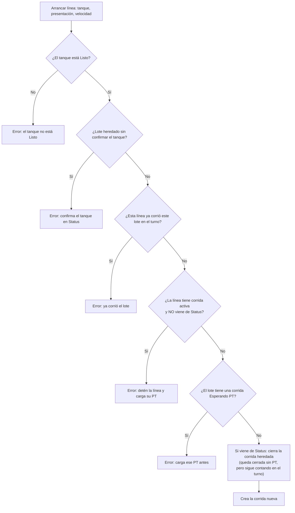
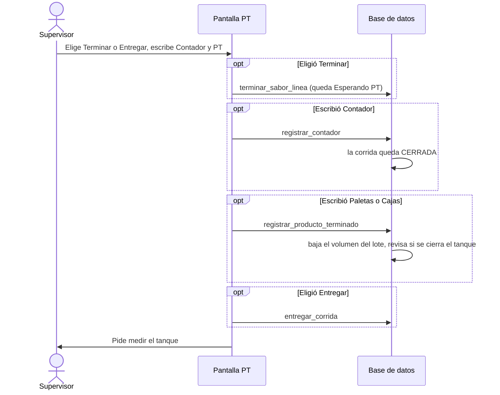

# Flujos: Líneas y Producto Terminado (cómo funciona hoy)

Los diagramas muestran lo que el código **hace hoy** (rama `main`, 2026-09-30),
no lo que debería hacer. El diseño nuevo está en `plan-lineas-pt-paradas.md`.

Se leyó el código de las pantallas y las reglas de la base de datos
(migraciones). Los problemas de la sección 5 son hallazgos por lectura:
hay que confirmarlos en planta.

## Cómo leer y editar los diagramas

- Cada caja `[Texto]` es un paso.
- Cada rombo `{¿Pregunta?}` es una decisión.
- Cada flecha `-->` indica qué pasa después. `-- texto -->` pone una etiqueta.
- Para cambiar un diagrama, edita el texto. GitHub y VS Code lo dibujan solos.

| Término | Qué significa | Cómo se guarda |
|---|---|---|
| Corrida | Una línea produciendo un lote | `turno_lineas` |
| Activa | La corrida está produciendo | `activa = true` |
| Esperando PT | Se detuvo, falta cargar su Producto Terminado | `activa = false` y `finalizada_en` vacío |
| Cerrada | Terminó del todo | `finalizada_en` con fecha |
| Entregada | Sigue corriendo para el próximo turno | `entregada_en` con fecha |

---

## 1. Estados de una corrida

Al abrir un turno, el sistema **copia** las corridas activas del turno
anterior al turno nuevo, sin confirmar.

---

## 2. Pantalla Líneas: qué botón aparece en cada estado

- Con una corrida activa o Esperando PT, **no** se puede poner la línea en CIP,
  Sin programación ni Cambio de Presentación.
- El CIP de línea **no guarda motivo**. Solo la condición "Parada" guarda texto.

---

## 3. Arrancar una línea (reglas de la base de datos)

---

## 4. Pantalla Producto Terminado: botón "Cerrar" / "Registrar"

Cada paso es una llamada **separada** a la base de datos.

Reglas de la base de datos:

- Contador 2 (envases buenos) es obligatorio y no puede superar al Contador 1.
- El PT solo se edita durante 1 hora. Después se corrige en Validar.
- Cargar Contador o PT confirma la línea si estaba sin confirmar.
- No se puede finalizar el turno con una corrida Esperando PT, ni con una
  activa sin entregar.

---

## 5. Problemas encontrados

| # | Problema | Dónde |
|---|---|---|
| 1 | "Terminar" con solo el Contador cierra la corrida **sin PT**, y Finalizar Turno no lo detecta | `ProductoTerminado.tsx` (`valido`, `guardar`), `registrar_contador` |
| 2 | Si el Contador guarda y el PT falla, al reintentar el Contador **se suma dos veces** | `ProductoTerminado.tsx`, `guardar()` |
| 3 | Los errores de PT, pausar, continuar, terminar, confirmar y detener dicen "Intenta de nuevo" y ocultan la causa real | `src/lib/productoTerminado.ts`, `src/lib/produccion/nucleo.ts`, `ajustes.ts` |
| 4 | El aviso "Medir tanque" probablemente no se ve: la tarjeta pasa a "cerradas" y se desmonta | `ProductoTerminado.tsx` (`medicionTanque`) |
| 5 | Dos textos mandan a "Preparación" cuando ahora es "Líneas" | `ProductoTerminado.tsx` líneas 217 y 842 |
| 6 | Una línea Esperando PT bloquea a otras líneas que quieran tomar ese mismo lote | `activar_linea` (puede ser intencional) |
| 7 | Tras "Continuar al siguiente lote", la tarjeta de Líneas no muestra la corrida vieja Esperando PT | `LineasEstadoPlanta.tsx` (`corridaEsperandoPt`) |
| 8 | Corregir una línea heredada en Status la deja cerrada en el turno nuevo: cuenta para la eficiencia aunque no produjo | `activar_linea` (camino de Status), `src/lib/eficiencia.ts` |
