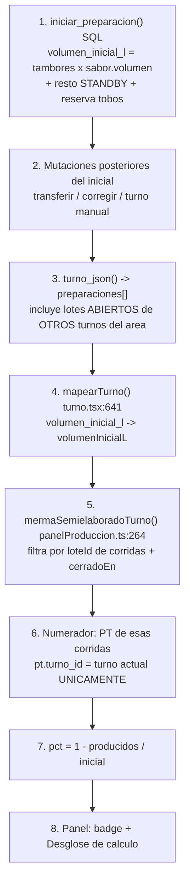

# Plan de debugging — Merma de semielaborado

**Regla dura de esta sesión:** no se toca NADA de Supabase (ni migraciones, ni funciones SQL, ni datos). Todo el instrumental es de solo lectura y vive en el frontend. En esta primera etapa **no se aplica ningún cambio**: primero acordamos el plan.

---

## 1. Qué dice la spec vs. qué hace el código hoy

**Lo que vos describís:** sumar los volúmenes iniciales de *todos* los tanques y dividir contra los litros producidos que salen de Producto Terminado.

**Lo que hace hoy** (`src/lib/panelProduccion.ts:264`, `mermaSemielaboradoTurno`):

```
merma % = 1 − ( Σ litros PT de lotes CERRADOS ÷ Σ volumen_inicial_l de lotes CERRADOS )
```

Tres diferencias frente a la spec, ya visibles sin correr nada:

1. Solo entran los lotes con `cerradoEn !== null`. Un lote abierto no suma ni arriba ni abajo (y pone `hayLoteAbierto = true`).
2. El denominador se arma por **lote**, no por tanque, y solo de los lotes que alimentaron una corrida (`turno.lineas[].loteId`). Un tanque preparado que no se usó nunca no entra.
3. `volumen_l` (el volumen actual del tanque) está deliberadamente fuera de la fórmula — porque no es una medición física, sale de restarle el PT al inicial.

Esto no es todavía "el bug", pero es la primera cosa a confirmar contra tu expectativa, porque cambia qué números tienen que aparecer en los logs.

---

## 2. La cadena del cálculo, en orden



Archivos exactos:

| # | Paso | Dónde |
| --- | --- | --- |
| 1 | Se **guarda** el valor inicial | `supabase/migrations/20260976090000_lote_en_tanque_y_historial_completo.sql` → `iniciar_preparacion()` (solo lectura) |
| 2 | Se **modifica** después | migraciones `20260952` (standby), `20260956` (corregir), `20260962`/`20260963` (transferir), `20260957`/`20260959` (turno manual) |
| 3 | Se **expone** al frontend | `turno_json()` en `20260975090000_producto_terminado_entrega_parcial.sql:539-571` |
| 4 | Se **mapea** | `src/lib/turno.tsx:641-656` |
| 5-7 | Se **calcula** | `src/lib/panelProduccion.ts:264-292` |
| 8 | Se **muestra** | `src/pages/apps/PanelProduccion.tsx:447`, `:857-870`, y el desglose en `:1401` |

---

## 3. La instrumentación que propongo

Ya existe media solución en el proyecto: el panel **"Desglose de cálculo"** (`PanelProduccion.tsx:1401`), que hoy solo se ve si el área es `PRUEBAS` o `ASEPTICO` (`:928`). Pero muestra agregados — no muestra **lote por lote**, que es exactamente donde está el problema.

Propongo una sola función nueva de trazado, `trazarMermaSemielaborado(turno)`, en un archivo nuevo `src/lib/debugMerma.ts`, que **no modifica ninguna fórmula**: lee el mismo `TurnoActivo` e imprime por `console.log` en este orden exacto:

**PASO 0 — Contexto del turno**
`turno.id`, `codigo`, `fecha`, `estado`, `area`, cuántas corridas, cuántas preparaciones, cuántos PT.

**PASO 1 — Inventario CRUDO de preparaciones** (todas las que llegaron del backend, sin filtrar)
Por cada una: `id` (corto), `numeroTanque`, `sabor`, `lote`, `volumenInicialL`, `volumenL`, `tambores`, `cerradoEn`, `creadoEn`, y una marca `¿es de este turno?`.
→ **Acá se ve si `volumen_inicial_l` viene mal guardado de raíz** (null, 0, igual a `volumenL`, o inflado).

**PASO 2 — Corridas y a qué lote apuntan**
Por cada `turno.lineas`: `id`, `linea`, `loteId`, `activa`, `presentacion`. Y la lista `loteIds` que arma la línea `panelProduccion.ts:265`.
→ Acá se ve si alguna corrida tiene `loteId = null` (su lote nunca entra al cálculo).

**PASO 3 — Filtro de elegibilidad, lote por lote**
Por cada lote de `loteIds`, cuál de estos tres caminos tomó y por qué:
- `DESCARTADO: no está en turno.preparaciones` (el `find` devolvió undefined)
- `DESCARTADO: volumenInicialL === null`
- `SALTADO: lote abierto (cerradoEn === null)` → prende `hayLoteAbierto`
- `CUENTA`
→ Este paso es el que más rápido explica un porcentaje absurdo.

**PASO 4 — Numerador, PT por lote**
Por cada lote que CUENTA: las `corridasDelLote`, y por cada PT asociado `turnoLineaId`, `paletas`, `cajasSueltas`, `litrosProducidos`; más el subtotal `ptLote`.
Y aparte: **los PT huérfanos** — los que tienen `turnoLineaId === null` o apuntan a una corrida que no está en el set. Esos litros existen pero no suman al numerador.

**PASO 5 — Acumuladores**
`volumenInicial += X (total N)`, `litrosProducidos += Y (total M)`, `litrosConsumidos += ...`, paso a paso en el mismo orden del `for`.

**PASO 6 — Fórmula final**
`1 − (M ÷ N) = pct`, con el redondeo explícito, más `hayLoteAbierto`.

**PASO 7 — Contraste**
El mismo `pct` como lo consume la UI, y al lado el cálculo "según tu spec" (Σ de **todos** los `volumenInicialL`, cerrados y abiertos, de todos los tanques, contra **todos** los litros de PT del turno) — para ver de una la brecha entre las dos definiciones.

**Cómo se dispara:** un `useEffect` en `PanelProduccion.tsx` que llama a la traza cuando `turno` cambia, activado por `localStorage.setItem("debugMerma","1")` o por `?debugMerma=1` en la URL. Sin flag, no imprime nada y no cambia el comportamiento de la app. Todo va a la consola del navegador (F12 → Console), listo para copiar y pegar.

---

## 4. Hipótesis, ordenadas por probabilidad

Cada una dice **qué paso del log la delata**.

**H1 — Doble conteo del volumen inicial al preparar sobre STANDBY / con reserva de tobos.**
`iniciar_preparacion()` hace `v_volumen_l := tambores × sabor.volumen + volumen_l del tanque en STANDBY` y le vuelve a sumar `reserva.litros`, y guarda ESE total como `volumen_inicial_l`. Pero esos litros de resto ya fueron contados en el `volumen_inicial_l` del lote anterior. Si los dos lotes cierran en el mismo turno, el denominador cuenta el mismo semielaborado dos veces → merma inflada.
→ **Se ve en PASO 1**: un lote cuyo `volumenInicialL` no es múltiplo limpio de `tambores × volumen del sabor`.

**H2 — Numerador y denominador con distinto alcance de turno.**
`turno_json()` trae preparaciones de **otros turnos** si están abiertas y son de la misma área (`:563-570`), pero Producto Terminado lo filtra estricto por `pt.turno_id = t.id` (`:537`). Un lote arrancado en el turno anterior que cierra en este aporta su volumen inicial COMPLETO al denominador, pero solo los litros de PT de este turno al numerador.
→ **Se ve en PASO 1** (marca "¿es de este turno?") cruzado con **PASO 4**.

**H3 — Transferencias entre tanques suman al inicial del destino.**
`20260962`/`20260963` hacen `volumen_inicial_l = volumen_inicial_l + volumen_l del origen`. Mismo litro contado en dos lotes.
→ **PASO 1**, dos lotes del mismo sabor donde el segundo tiene un inicial "raro".

**H4 — Corridas con `loteId = null` o PT sin `turnoLineaId`.**
Los litros existen pero no llegan al numerador → merma inflada.
→ **PASO 2** y la sección de huérfanos del **PASO 4**.

**H5 — Diferencia de definición (lotes abiertos).**
Si en el turno quedan lotes abiertos, el número que ves es de un subconjunto, no de "todos los tanques".
→ **PASO 3** + **PASO 7**.

**H6 — `volumen_inicial_l` null o backfilleado.**
La migración `20260945` creó la columna con `volumen_inicial_l = volumen_l` para lo viejo. En lotes anteriores a esa fecha el inicial ES el final → merma ≈ 0 o negativa.
→ **PASO 1**, `volumenInicialL === volumenL` exacto.

---

## 5. Cómo trabajamos (paso a paso, juntos)

1. Yo agrego `src/lib/debugMerma.ts` + el `useEffect` con flag en `PanelProduccion.tsx`. Nada más. Cero cambios de fórmula, cero Supabase.
2. Vos corrés `npm run dev`, entrás al Panel de Producción con el turno que muestra el número mal, activás el flag y me pasás lo que imprime.
3. Vamos leyendo de PASO 0 hacia abajo. En cuanto un paso muestre un número que no cierra, paramos ahí y profundizamos ese paso antes de seguir.
4. Recién cuando el origen esté identificado y acordado, discutimos el arreglo — y si el arreglo cae del lado de Supabase, te lo describo pero no lo toco.

---

## 6. Lo que necesito de vos para arrancar

- ¿El turno donde se ve mal es **en curso** o **cerrado**? (los cerrados usan volúmenes congelados, `20260968`)
- Un ejemplo concreto: qué porcentaje muestra y qué esperabas.
- ¿Hubo en ese turno preparación sobre un tanque en STANDBY, transferencia entre tanques, o "Corregir"?
- ¿La app corre contra la Supabase real con datos de producción o contra datos de prueba?

**Respondido por el jefe (ver punto 7):** turno CERRADO, preparación normal + una corrección de volumen al final, Supabase real.

---

## 7. HALLAZGO — la corrección de volumen se resta del valor inicial (confirmado aritméticamente)

Con los datos del jefe (turno cerrado, preparación normal + una corrección de volumen al final) la causa queda identificada sin necesidad de correr nada. **No es un error de la fórmula de merma: es un error al guardar el valor inicial**, exactamente como sospechaba.

### El código culpable

`cambiar_condicion_tanque()` — última versión en `supabase/migrations/20260983090000_editar_tanque_en_preparacion.sql:150` (misma lógica introducida en `20260956090000`):

```sql
update preparaciones
set volumen_inicial_l = coalesce(volumen_inicial_l, 0) + (p_volumen_l - coalesce(volumen_l, 0)),
    volumen_l = p_volumen_l
where id = v_lote_id and cerrado_en is null;
```

Cuando el supervisor corrige el volumen que queda en el tanque, el delta se le suma **al valor inicial**. Es decir: los litros que faltan se borran del punto de partida en vez de contarse como pérdida.

### El caso, número por número


| `volumen_inicial_l` guardado al preparar | **18.380 L** |
| Producto Terminado registrado | **11.056 L** |
| `volumen_l` que el sistema calculó solo (18.380 − 11.056) | **7.324 L** ← los "7.000 y tantos" |
| Lo que el supervisor midió de verdad y tipeó | **4.700 L** |
| Delta de la corrección | **−2.624 L** |
| `volumen_inicial_l` DESPUÉS de la corrección | **15.756 L** |

Y entonces:

|  | Merma | Rendimiento |
| --- | --- | --- |
| Lo que muestra la app (denominador 15.756) | **29,83 %** | **70,17 %** |
| Lo correcto (denominador 18.380) | **39,85 %** | **60,15 %** ← el ~59 % que esperaban |

El `7.324` que sale del cálculo coincide clavado con los "7.000 y tantos" del relato, y el 60,15 % con el 59 % esperado. La hipótesis encaja con los dos extremos.

### Por qué pasa esto conceptualmente

Esos 2.624 L **son merma** — semielaborado que se preparó y nunca llegó a producto terminado. Pero el sistema los interpreta como "el punto de partida estaba mal medido" y se los descuenta al inicial. Como el numerador (PT) no se mueve, el rendimiento **sube** artificialmente: la app premia justo la operación que debería castigar. Cuanto más grande el faltante que reporta el supervisor, mejor se ve la merma.

### Esto ya estaba documentado en el repo

La migración `20260988090000_ajuste_teorico_real_semielaborado.sql` lo dice con todas las letras:

> "Ese delta (litros que quedaron 'en el aire') se perdía dentro de `volumen_inicial_l` y no quedaba registrado en ningún lado."

La solución que se aplicó fue **registrar** el ajuste en la tabla `preparaciones_ajuste` y mostrarlo en el desglose como "Ajuste teórico vs. real" — pero **no se corrigió el denominador de la merma**. El dato quedó anotado al costado; el porcentaje siguió saliendo mal.

### Efecto secundario: la merma de un turno CERRADO se puede mover después

El congelamiento de la migración `20260968` snapshotea `volumen_l` al cerrar el turno — pero `mermaSemielaboradoTurno()` **no usa `volumen_l`**, usa `volumen_inicial_l`, que se lee siempre en vivo y no se congela nunca. Además el `update` de arriba lleva `where ... and cerrado_en is null`: si el lote ya estaba cerrado cuando el supervisor corrigió, la corrección se ignoró en silencio y ni siquiera quedó el registro del ajuste. Hay que confirmar cuál de los dos casos aplica a este turno.

### Qué queda por confirmar (y cómo)

La aritmética encaja, pero conviene verificarlo contra los datos reales antes de tocar nada. Con el turno ya identificado, la traza del punto 3 se simplifica a **consultas de solo lectura** sobre ese lote:

1. `preparaciones` del lote → `volumen_inicial_l`, `volumen_l`, `cerrado_en`, `tambores`.
2. `preparaciones_ajuste` de ese lote → `volumen_teorico`, `volumen_real`, `diferencia`. Si la fila existe, `diferencia` debería ser ≈ −2.624 y `volumen_inicial_l + |diferencia|` debería devolver los 18.380 originales.
3. `tambores × sabores.volumen` → tiene que dar los 18.380 originales. Si da eso, queda probado que el inicial fue alterado después de guardarse.
4. La auditoría (`20260984090000_auditoria_produccion.sql`) puede tener el valor previo del `update`.

### Direcciones de arreglo (para discutir, NADA aplicado)

- **A — Arreglo en el frontend, sin tocar Supabase (respeta la restricción).** `mermaSemielaboradoTurno()` reconstruye el inicial real sumándole de vuelta los ajustes: `volumen_inicial_l − Σ diferencia` de `preparaciones_ajuste` (la función de lectura `ajustesSemielaboradoTurno()` ya existe y ya se consume en el Panel). Nada de escritura, nada de migraciones. Los datos históricos quedan corregidos solos.
- **B — Arreglo en SQL.** Dejar de mover `volumen_inicial_l` en la corrección y ajustar solo `volumen_l`. Es lo correcto de raíz, pero requiere migración (fuera de límites por ahora) y no arregla los turnos ya afectados.

La opción A es la que recomiendo dado que Supabase está vedado, y además es reversible.

---

## 8. Pregunta aparte: ¿cómo se lee el "turno anterior"?

**Ni por horario solo, ni por código único.** `turno_anterior_json()` (`supabase/migrations/20260966090000_turno_anterior_una_sola_formula.sql`) hace:

```sql
select t.id from turnos t join areas a on a.id = t.area_id
where a.codigo = p_area_codigo
  and t.estado = 'CERRADO'
  and (p_turno_actual_id is null or t.id <> p_turno_actual_id)
order by t.fecha desc, coalesce(t.hora_fin, t.hora_inicio) desc, t.created_at desc
limit 1;
```

O sea: **el último turno CERRADO de la misma área**, ordenado por `fecha` ↓, después por `hora_fin` (o `hora_inicio` si no cerró) ↓, y como desempate `created_at` ↓. El turno actual se excluye por `id`. El código del turno (`A20260826_T1G2`) no participa en la selección — solo se muestra después.

Dos consecuencias prácticas:

- Es **por área**, no por línea ni por grupo: el "turno anterior" puede ser de otro supervisor y otro grupo.
- El ordenamiento es por fecha + hora, así que un turno cargado a destiempo (por ejemplo uno manual con fecha vieja) no aparece aunque se haya creado recién; y al revés, `created_at` solo desempata cuando fecha y hora coinciden.

Una vez elegido, se corre por `turno_json()` y por las **mismas** funciones del frontend que el turno en vivo (`obtenerResumenTurnoAnterior`, `panelProduccion.ts:325`) — así que **el turno anterior arrastra exactamente el mismo bug del punto 7**.

---

## 9. Datos de la jefa — dos números distintos que se están confundiendo

Datos nuevos: **inicial 18.830 L** (no 18.380 — dígitos traspuestos), final en tanque **4.700 L**, más **1.500 L en el pasteurizador**. Regla confirmada: *el inicial para la aritmética siempre sale de `tambores × volumen del sabor`.*

### Balance físico


| Inicial teórico (`tambores × volumen del sabor`) | 18.830 L |
| Queda en el tanque | −4.700 L |
| Queda en el pasteurizador | −1.500 L |
| **Consumido de verdad** | **12.630 L** |
| Producto Terminado | −11.056 L |
| **PÉRDIDA REAL** | **1.574 L** ← los "1.000 y tantos" |

1.574 L es **8,36 %** del inicial, o **12,46 %** de lo que realmente se consumió.

### Los tres números en juego

| Número | Valor | Qué significa |
| --- | --- | --- |
| Lo que muestra la app hoy | merma **29,83 %** / rendimiento **70,17 %** | Mal: denominador corrompido a 15.756 |
| Fórmula del Panel con el inicial correcto | merma **41,29 %** / rendimiento **58,71 %** | El **\~59 %** que espera el jefe |
| Pérdida física real | **1.574 L** = 8,36 % | Lo que describe la jefa |

**El 41,29 % no es "se perdió el 41 %".** La fórmula del Panel trata como merma todo lo que todavía no llegó a Producto Terminado — y ahí adentro están los 4.700 L del tanque y los 1.500 L del pasteurizador, que **siguen existiendo**. La fórmula solo equivale a la merma real cuando el lote quedó completamente drenado. En este turno no fue el caso: quedaron 6.200 L de semielaborado vivo.

Hay que decidir explícitamente cuál de los dos indicadores se quiere. Son legítimos pero distintos, y hoy la pantalla dice "Merma de semielaborado" para el primero.

### El pasteurizador no existe en el sistema

`grep -rni "pasteuriz" src supabase` → **cero resultados**. El modelo de datos solo conoce tanque y Producto Terminado. Los 1.500 L del pasteurizador son invisibles: no hay dónde cargarlos, así que ninguna fórmula los puede descontar. Es un hueco independiente del bug del punto 7, y es la razón de fondo por la que el % del Panel nunca va a coincidir con la pérdida real mientras quede producto en tránsito.

### Prueba matemática de que el inicial se destruye

Después de la corrección:

```
volumen_inicial_l  =  inicial + (volumen_real − (inicial − PT))
                   =  PT + volumen_real
                   =  11.056 + 4.700  =  15.756
```

El `inicial` **se cancela algebraicamente**. El resultado ya no depende de si el tanque arrancó con 18.830 o con 50.000: cualquier corrección de volumen colapsa el denominador a `PT + lo que quede`, y la merma pasa a ser `1 − PT/(PT + final)` — un número que ignora por completo lo que se preparó. Por eso el mismo 15.756 apareció con 18.380 y con 18.830.

### Arreglo revisado (mejor que la opción A del punto 7)

Con la regla "el inicial siempre es `tambores × volumen del sabor`", el arreglo en frontend no necesita `preparaciones_ajuste`: `mermaSemielaboradoTurno()` recalcula el inicial teórico desde `preparacion.tambores × sabor.volumen`, ignorando el `volumen_inicial_l` que llega corrompido. Datos que ya están en `TurnoActivo`: `preparaciones[].tambores` y `preparaciones[].saborId` (`src/lib/turno.tsx:641-656`); `volumen` sale de `src/lib/sabores.ts:11`.

Dos detalles a resolver:

1. **Los sabores no están en `CatalogosProvider`** (`catalogosLive.tsx` trae líneas, presentaciones y velocidades, no sabores). Hay que cargarlos en el Panel o sumarlos al provider.
2. **Casos donde `tambores × volumen` NO es el inicial completo**: preparar sobre un tanque en STANDBY suma el resto, y las transferencias entre tanques suman el volumen del origen. Ahí el teórico puro se queda corto. Confirmar con la jefa si la regla aplica igual en esos casos o si hay que sumarles el aporte externo.

---

## 10. Ver el arreglo local, sin tocar la base de datos

**Sí, y el proyecto ya viene preparado para eso.** `src/lib/calculosPruebas.ts` + `src/lib/__fixtures__/casos-calculo.csv` + `src/lib/calculosPruebas.test.ts` son un banco de pruebas que arma un `TurnoActivo` desde un CSV y lo hace pasar por las **mismas funciones** del Panel (`mermaSemielaboradoTurno`, `mermaEnvasesTurno`, `calcularMeta`). No reimplementa nada, no abre conexión a Supabase, no necesita credenciales: corre offline con `npm test`.

El plan es agregar al CSV una fila con el caso real:

```
tanque 3, litros_iniciales 18830, litros_finales 4700, lote_cerrado si,
pt_litros 11056, esp_rendimiento_turno_pct 41.29
```

Con eso: el test **falla hoy** (la app da 29,83 %), y **pasa** con el arreglo. Queda como prueba de regresión permanente, y todo el ciclo es local y reversible — se toca solo `src/`.

**Limitación actual de mi entorno:** en esta máquina no hay Node instalado (`node`, `npm`, `npx` no existen en el PATH; tampoco hay nvm/volta/bun), así que **no puedo correr `npm test` yo mismo**. El `npm install` que lancé no instaló nada. Opciones: instalar Node acá, o que ejecutes vos `npm install && npm test` y me pases la salida.

---

# PARTE II — Consolidación del "valor inicial" por caso

## 11. Catálogo de referencia (datos reales del seed `20260820120000`)

| Presentación | cajas/paleta | L/caja | envases/caja | **L por paleta** | **envases por paleta** |
| --- | --- | --- | --- | --- | --- |
| 1000 ml | 85 | 12 | 12 | 1.020 | 1.020 |
| 250 ml | 140 | 6 | 24 | 840 | 3.360 |
| 200 ml | 140 | 4,8 | 24 | 672 | 3.360 |

Fórmulas del sistema (columna generada, `20260831090000_producto_terminado.sql:36`):

```
cajas          = paletas × cajas_x_paleta + cajas_sueltas
litros_PT      = cajas × litros_x_caja
envases_PT     = cajas × envases_x_caja
merma_envase % = 1 − envases_PT ÷ contador_envases
merma_semi   % = 1 − litros_PT ÷ volumen_inicial_l
```

Sabor hipotético usado en todos los casos: **1.000 L por tambor** (números redondos para poder verificar a mano).

## 12. Regla consolidada — qué es el valor inicial y cuándo se fija

> **El valor inicial de un lote son los litros que ENTRARON a ese lote, contados una sola vez en toda la planta, fijados en el momento en que entran y jamás recalculados después.**

**Lo que SÍ es valor inicial** (litros nuevos que entran al lote):

| Origen | Cuánto | ¿Es semielaborado nuevo? |
| --- | --- | --- |
| Preparación fresca | `tambores × volumen del sabor` | **Sí** — único origen realmente nuevo |
| Resto heredado de un tanque en STANDBY | `volumen_l` del tanque | **No** — ya se contó en el lote anterior |
| Transferencia desde otro tanque | `volumen_l` del origen | **No** — ya se contó en el lote origen |
| Reserva de tobos consumida | `reserva.litros` | **No** — ya se contó en su lote origen |

Las tres últimas entran al lote destino pero **hoy no salen del lote origen** → el mismo litro se cuenta dos veces en el total de la planta.

**Lo que NUNCA debe modificar el valor inicial:**

| Evento | ¿Toca `volumen_inicial_l` hoy? | ¿Debería? |
| --- | --- | --- |
| Registrar Producto Terminado | No (solo baja `volumen_l`) | Correcto ✅ |
| **Corregir el volumen del tanque** | **Sí, le suma el delta** | **NO — es el bug del punto 7** ❌ |
| Transferir a otro tanque (destino) | Sí, le suma el origen | Solo si se descuenta del origen ⚠️ |
| Cerrar el lote / cerrar el turno | No | Correcto ✅ |

**Y el denominador de un TURNO** = Σ valor inicial de los lotes *atribuibles a ese turno*. Acá está el segundo agujero: hoy la atribución es "el turno donde se creó el lote se come el inicial completo", sin importar en qué turno se produjo el PT.

## 13. Tabla de consolidación — los 7 casos

| # | Caso | ¿Qué guarda el sistema como inicial? | ¿Qué debería ser? | Veredicto |
| --- | --- | --- | --- | --- |
| 1 | Status del turno anterior llega **bien** | `volumen_inicial_l` del turno donde se creó el lote | Igual — pero repartido entre los turnos que produjeron | ❌ El inicial completo se le carga al turno 1; el turno 2 muestra "—" |
| 2 | Status del turno anterior llega **mal**, se edita | `inicial + (real − volumen_l)` = **`PT + real`** | El inicial original, intacto | ❌ Bug del punto 7 — el inicial se destruye |
| 3 | Se envió un **valor parcial** del lote | Inicial intacto; el PT se acumula | Inicial intacto ✔ | ⚠️ Riesgo de doble conteo del PT si se registra un total sin `forzar_total` |
| 4 | El lote **continúa** en el siguiente turno | Inicial completo en el turno de creación | Repartido, o merma solo al cerrar | ❌ Igual que el caso 1, agravado |
| 5 | Status OK, se da cuenta tarde y **edita un lote al 100 %** | `PT + real` (con PT ≈ 0 → inicial ≈ real) | El inicial original | ❌ Peor variante del caso 2 |
| 6 | Preparación + **transferencia** (al 100 % y < 100 %) | Destino: `inicial + volumen_l origen`. Origen: sin cambios | Origen debe **descontar** lo que entregó | ❌ Doble conteo en el total de planta |
| 7 | **Termina un lote** que en su turno decía < 100 % | Inicial del turno de creación | Idem | ❌ Mismo desfase de atribución que 1 y 4 |

Los casos se agrupan en **tres familias de falla**: **(A)** el inicial se destruye al corregir (casos 2, 5), **(B)** el inicial se atribuye al turno equivocado (casos 1, 4, 7), **(C)** el mismo litro se cuenta dos veces (caso 6). El caso 3 es el único donde el inicial está bien y el riesgo está del lado del numerador.

---

## 14. CASO 1 — El lote llega del turno anterior y el status está correcto

**Escenario:** el turno 1 preparó tres lotes (uno por tanque, uno por línea) y los dejó abiertos. El turno 2 los recibe, el supervisor revisa el status, **confirma que el valor está bien y no edita nada**, produce y drena los tres tanques.

Como no se edita, `cambiar_condicion_tanque` no corre con el mismo lote → **`volumen_inicial_l` queda intacto**. El bug del punto 7 NO participa acá. Y sin embargo el número sale mal.

### 1A — Merma positiva (se perdió producto)

**Preparación en el turno 1** (`volumen_inicial_l` = tambores × 1.000 L):

| Lote | Tanque | Línea | Presentación | Tambores | **Inicial** |
| --- | --- | --- | --- | --- | --- |
| L-101 | 1 | Línea 1 | 1000 ml | 20 | 20.000 L |
| L-102 | 2 | Línea 2 | 250 ml | 12 | 12.000 L |
| L-103 | 3 | Línea 3 | 200 ml | 9 | 9.000 L |
|  |  |  |  |  | **41.000 L** |

**Producto Terminado del turno 1:**

| Lote | Paletas + sueltas | Cajas | × L/caja | **Litros** | Envases |
| --- | --- | --- | --- | --- | --- |
| L-101 (1000) | 7 p + 70 c | 7×85+70 = 665 | ×12 | **7.980 L** | 7.980 |
| L-102 (250) | 5 p + 100 c | 5×140+100 = 800 | ×6 | **4.800 L** | 19.200 |
| L-103 (200) | 4 p + 80 c | 4×140+80 = 640 | ×4,8 | **3.072 L** | 15.360 |
|  |  |  |  | **15.852 L** |  |

`volumen_l` al cerrar el turno 1: L-101 = 12.020 · L-102 = 7.200 · L-103 = 5.928.

**Turno 2** — el supervisor ve esos valores en el status, **los confirma sin editar**:

| Lote | Paletas + sueltas | Cajas | **Litros** | Envases | Contador | Merma envase |
| --- | --- | --- | --- | --- | --- | --- |
| L-101 (1000) | 11 p + 15 c | 950 | **11.400 L** | 11.400 | 11.500 | 0,87 % |
| L-102 (250) | 8 p + 20 c | 1.140 | **6.840 L** | 27.360 | 27.600 | 0,87 % |
| L-103 (200) | 8 p + 100 c | 1.220 | **5.856 L** | 29.280 | 29.550 | 0,91 % |
|  |  |  | **24.096 L** |  |  |  |

Los tres tanques se drenan y los tres lotes se cierran en el turno 2.

**Balance físico real (el lote completo, los dos turnos juntos):**

| Lote | Inicial | PT T1 | PT T2 | Residuo perdido | Merma real |
| --- | --- | --- | --- | --- | --- |
| L-101 | 20.000 | 7.980 | 11.400 | 620 L | 3,10 % |
| L-102 | 12.000 | 4.800 | 6.840 | 360 L | 3,00 % |
| L-103 | 9.000 | 3.072 | 5.856 | 72 L | 0,80 % |
| **Total** | **41.000** | 15.852 | 24.096 | **1.052 L** | **2,57 %** |

**Lo que muestra la app, paso por paso:**

*Turno 2* — `mermaSemielaboradoTurno` recorre `loteIds` = {L-101, L-102, L-103}, pero `turno.preparaciones.find(...)` devuelve `undefined` para los tres. Motivo: en `turno_json()` la cláusula es

```sql
where prep.turno_id = t.id
   or (prep.cerrado_en is null and <misma área>)
```

Los tres lotes tienen `turno_id = T1 ≠ T2`, y al haberse cerrado ya no cumplen `cerrado_en is null` → **quedan fuera del JSON**. Entonces `continue` en los tres → `volumenInicial = 0` → `pct = null` → **la pantalla muestra "—"**.

*Turno 1* — ahí `prep.turno_id = t.id`, así que los tres lotes **siempre** están incluidos. Ahora tienen `cerrado_en ≠ null`, así que **cuentan**. Pero el PT que se les suma es solo el de las corridas del turno 1:

```
merma T1 = 1 − 15.852 ÷ 41.000 = 61,34 %
```

|  | Merma de semielaborado |
| --- | --- |
| Realidad física | **2,57 %** |
| Lo que muestra el turno 1 | **61,34 %** |
| Lo que muestra el turno 2 | **"—"** |

**Y hay un efecto temporal:** mientras los lotes estaban abiertos, el turno 1 mostraba `— (lote abierto)`. En el momento en que el supervisor del turno 2 cierra los tanques, el número del turno 1 —un turno **ya cerrado, ya firmado en el acta**— salta solo de "—" a 61,34 %. El congelamiento de la migración `20260968` no lo evita porque congela `volumen_l`, y esta fórmula no usa `volumen_l`.

### 1B — Merma negativa (rendimiento > 100 %)

**Escenario:** mismo arranque, pero en el turno 2 los tanques se drenan temprano, se cierran los lotes heredados y se arrancan lotes nuevos. El PT de la cola de los lotes viejos se carga tarde, **contra la corrida del lote nuevo**.

> Nota de mecánica: al hacer "Iniciar Preparación" sobre un tanque en **LISTO**, `iniciar_preparacion()` cierra el lote viejo y crea el nuevo con `volumen_inicial_l = tambores × volumen` **sin arrastrar el resto del tanque** (solo el caso STANDBY lo arrastra). Por eso los iniciales de abajo son limpios.

| Lote nuevo | Línea | Presentación | Tambores | **Inicial** |
| --- | --- | --- | --- | --- |
| L-201 | 1 | 1000 ml | 6 | 6.000 L |
| L-202 | 2 | 250 ml | 5 | 5.000 L |
| L-203 | 3 | 200 ml | 4 | 4.000 L |
|  |  |  |  | **15.000 L** |

**Producto Terminado registrado contra esas corridas** (incluye la cola del lote viejo):

| Lote | Paletas + sueltas | Cajas | **Litros** | Envases | Contador | Merma envase |
| --- | --- | --- | --- | --- | --- | --- |
| L-201 (1000) | 6 p + 30 c | 540 | **6.480 L** | 6.480 | 6.550 | 1,07 % |
| L-202 (250) | 6 p + 20 c | 860 | **5.160 L** | 20.640 | 20.800 | 0,77 % |
| L-203 (200) | 6 p + 40 c | 880 | **4.224 L** | 21.120 | 21.300 | 0,85 % |
|  |  |  | **15.864 L** |  |  |  |

**Merma de semielaborado, lote por lote:**

| Lote | Cálculo | Resultado |
| --- | --- | --- |
| L-201 | 1 − 6.480 ÷ 6.000 | **−8,00 %** |
| L-202 | 1 − 5.160 ÷ 5.000 | **−3,20 %** |
| L-203 | 1 − 4.224 ÷ 4.000 | **−5,60 %** |
| **Turno 2 agregado** | 1 − 15.864 ÷ 15.000 | **−5,76 %** (rendimiento **105,76 %**) |

La pantalla muestra un **rendimiento del 105,76 %**: se envasó más producto del que entró al tanque. El Panel no tiene ningún tope ni validación contra esto — `nivelMerma()` lo pinta verde, porque cualquier valor por debajo del 3 % es "ok". **Una merma negativa se muestra como el mejor turno del mes.**

Además, la merma de **envase** de las tres corridas es normal (0,8–1,1 %), así que nada en la pantalla delata el problema: el número raro es solo el de semielaborado.

---

## 15. Correcciones tras la revisión con la jefa

**Unidad y sabor real:** el lote real era **Manzana Selecto, 5 kits → 18.830 L**, o sea **3.766 L por kit**. La unidad es *kits*, no tambores (ver `20260986090000_unidad_preparacion_kits.sql`; `sabores.volumen` es por unidad y el cálculo `cantidad × volumen` no cambia, solo el rótulo). De acá en adelante uso **kits** y un sabor ficticio de **1.000 L por kit**.

**Presentación siempre rotulada:** cada lote/línea lleva explícito si es 1000, 250 o 200 ml.

**El caso 1B anterior queda descartado.** Se apoyaba en un error de carga del operador (cargar el PT contra la corrida equivocada), y al revisar la UI eso no hace falta: `ProductoTerminado.tsx:138` deja cargar PT contra corridas **ya cerradas**, así que el supervisor tiene cómo hacerlo bien. Reemplazado por el mecanismo estructural de abajo.

---

## 16. CASO 1B (revisado) — Merma negativa: preparar sobre un tanque que todavía tiene producto

### Qué significa "merma negativa"

Que la app diga que salieron **más litros de producto terminado que los que entraron al tanque**. Rendimiento por encima del 100 %. Físicamente imposible: si sale más de lo que entró, es que el numerador y el denominador están hablando de **líquidos distintos**.

### El mecanismo, en una frase

**Cuando se arranca una preparación nueva sobre un tanque que está en LISTO y todavía tiene producto adentro, el sistema descarta de la cuenta los litros que quedaban — pero el líquido sigue físicamente en el tanque y se envasa igual.**

### Por qué pasa

`iniciar_preparacion()` (`20260976090000_lote_en_tanque_y_historial_completo.sql`) trata distinto a los dos tanques con producto:

```sql
if v_tanque_actual.condicion = 'LISTO' and v_tanque_actual.lote_id is not null then
    update preparaciones set cerrado_en = now() where id = v_tanque_actual.lote_id ...
    -- cierra el lote viejo y NO arrastra su volumen
elsif v_tanque_actual.condicion = 'STANDBY' then
    v_volumen_l := v_volumen_l + coalesce(v_tanque_actual.volumen_l, 0);
    -- SI arrastra el resto
end if;
```

- **STANDBY ("Con restos")** → suma el resto al lote nuevo ✅
- **LISTO** → cierra el lote viejo y el resto **desaparece de la contabilidad** ❌

Y el frontend hace exactamente lo mismo: `EstadoPlantaTabs.tsx:455` pasa `volumenRestante={tanque.condicion === "STANDBY" ? (tanque.volumenL ?? 0) : 0}` — en LISTO manda 0.

**Lo grave es que la UI ofrece el botón igual:** `EstadoPlantaTabs.tsx:469` muestra **"Iniciar nueva preparación"** sobre un tanque en LISTO. No hay aviso de que los litros que quedan se van a perder de la cuenta. Es una trampa: el supervisor tendría que acordarse de marcar el tanque como STANDBY primero.

### Los números

Turno 2 recibe tres tanques del turno anterior, **cada uno con menos del 100 %**, y sobre los tres se arranca preparación nueva:

| Línea | **Presentación** | Resto del lote viejo | Preparación nueva | **Inicial que guarda** | **Litros físicos reales** |
| --- | --- | --- | --- | --- | --- |
| Línea 1 | **1000 ml** | 1.160 L | 6 kits × 1.000 = 6.000 L | **6.000 L** | **7.160 L** |
| Línea 2 | **250 ml** | 900 L | 5 kits × 1.000 = 5.000 L | **5.000 L** | **5.900 L** |
| Línea 3 | **200 ml** | 600 L | 4 kits × 1.000 = 4.000 L | **4.000 L** | **4.600 L** |
|  |  | **2.660 L** | 15.000 L | **15.000 L** | **17.660 L** |

Producto Terminado del turno 2:

| Línea | **Presentación** | Paletas + sueltas | Cajas | × L/caja | **Litros** | Envases | Contador | Merma envase |
| --- | --- | --- | --- | --- | --- | --- | --- | --- |
| Línea 1 | **1000 ml** | 6 p + 30 c | 6×85+30 = 540 | ×12 | **6.480 L** | 6.480 | 6.550 | 1,07 % |
| Línea 2 | **250 ml** | 6 p + 20 c | 6×140+20 = 860 | ×6 | **5.160 L** | 20.640 | 20.800 | 0,77 % |
| Línea 3 | **200 ml** | 6 p + 40 c | 6×140+40 = 880 | ×4,8 | **4.224 L** | 21.120 | 21.300 | 0,85 % |
|  |  |  |  |  | **15.864 L** |  |  |  |

**Merma de semielaborado, lote por lote:**

| Línea | Presentación | Lo que muestra la app | La realidad |
| --- | --- | --- | --- |
| Línea 1 | 1000 ml | 1 − 6.480 ÷ 6.000 = **−8,00 %** | 1 − 6.480 ÷ 7.160 = **9,50 %** |
| Línea 2 | 250 ml | 1 − 5.160 ÷ 5.000 = **−3,20 %** | 1 − 5.160 ÷ 5.900 = **12,54 %** |
| Línea 3 | 200 ml | 1 − 4.224 ÷ 4.000 = **−5,60 %** | 1 − 4.224 ÷ 4.600 = **8,17 %** |
| **Turno** |  | 1 − 15.864 ÷ 15.000 = **−5,76 %** | 1 − 15.864 ÷ 17.660 = **10,17 %** |

**El turno perdió realmente un 10,17 % de semielaborado y la app muestra un rendimiento del 105,76 %** — se dio vuelta el signo. Los **2.660 L** que quedaban en los tres tanques nunca entraron a ninguna cuenta.

Y como antes: la merma de **envase** queda perfecta (0,8–1,1 %) en las tres líneas, así que nada más en la pantalla avisa. Peor: `nivelMerma()` pinta el −5,76 % de **verde**, porque todo lo que esté por debajo del 3 % es "ok".

### Los tres caminos a merma negativa, ordenados

| Camino | ¿Estructural o error humano? | ¿Modelado? |
| --- | --- | --- |
| Preparar sobre un tanque LISTO con producto adentro | **Estructural** — la UI lo ofrece sin avisar | ✅ Este caso |
| Registrar un PT total después de parciales sin `forzar_total` → el PT se suma dos veces | Estructural (condición de borde) | Caso 3 |
| Cargar el PT contra la corrida del lote siguiente | Error humano, evitable desde la UI | Descartado |

---

## 17. CASO 1C — Tanque limpio, el lote abre y cierra en el mismo turno (baseline sano)

El caso más simple: tres tanques limpios, preparación fresca, se produce y se cierra el lote antes de terminar el turno. **Sin herencia, sin ediciones, sin transferencias.**

| Línea | **Presentación** | Kits | **Inicial** | PT (paletas+sueltas) | Cajas | **Litros** | Envases | Contador | Merma envase | **Merma semi** |
| --- | --- | --- | --- | --- | --- | --- | --- | --- | --- | --- |
| Línea 1 | **1000 ml** | 10 | 10.000 L | 9 p + 55 c | 820 | 9.840 L | 9.840 | 9.930 | 0,91 % | **1,60 %** |
| Línea 2 | **250 ml** | 8 | 8.000 L | 9 p + 40 c | 1.300 | 7.800 L | 31.200 | 31.500 | 0,95 % | **2,50 %** |
| Línea 3 | **200 ml** | 6 | 6.000 L | 8 p + 100 c | 1.220 | 5.856 L | 29.280 | 29.550 | 0,91 % | **2,40 %** |
| **Turno** |  |  | **24.000 L** |  |  | **23.496 L** |  |  |  | **2,10 %** |

**Los tres números coinciden con la realidad.** Residuos perdidos: 160 + 200 + 144 = 504 L → 504 ÷ 24.000 = 2,10 % ✔

Este es el **único** de los casos donde la fórmula actual da bien. Sirve como control: si el arreglo rompe este caso, el arreglo está mal.

---

## 18. LA REGLA DEL MOMENTO — cuándo la edición es inofensiva y cuándo destruye el dato

Toda corrección de volumen (`cambiar_condicion_tanque` sobre el mismo lote) hace:

```
inicial_nuevo = inicial_viejo + (real − volumen_l)
              = inicial_viejo + real − (inicial_viejo − PT_acumulado)
              = PT_acumulado + real
```

**El `inicial_viejo` se cancela siempre.** El valor inicial deja de ser "lo que se preparó" y pasa a ser "todo lo que ya se envasó + lo que queda". De ahí salen tres consecuencias que ordenan todos los casos:

### Consecuencia 1 — Editar ANTES de producir es correcto; editar DESPUÉS destruye el dato

| Momento de la edición | `PT_acumulado` | `inicial_nuevo` | Veredicto |
| --- | --- | --- | --- |
| Justo después de preparar, sin producir nada | **0** | `= real` | ✅ **Correcto** — el inicial queda igual al volumen real medido |
| Después de haber producido | **> 0** | `= PT + real` | ❌ **Borra exactamente ` | delta | ` litros de merma** |

**Esto valida el flujo que describen los supervisores:** "agregan una preparación y luego editan al volumen real" — si editan **enseguida**, antes de envasar nada, el resultado es correcto, e incluso **recupera** los litros que `iniciar_preparacion` había descartado sobre un tanque LISTO (caso 1B). El problema aparece cuando la edición llega tarde ("se dio cuenta tarde", el caso 5).

### Consecuencia 2 — Una edición no puede dar merma negativa; siempre subestima

Después de editar, la merma que va a mostrar la app al cerrar el lote es:

```
merma = 1 − PT ÷ (PT + real) = real ÷ (PT + real)   ≥ 0 siempre
```

La merma pasa a medir **solo la fracción que todavía está en el tanque**, no lo que se perdió. Si el lote se drena por completo (`real = 0`), la merma da **0 %** por construcción. **Una corrección resetea el contador de merma a cero:** toda pérdida anterior a la edición se borra.

Por lo tanto: **los casos 2 y 5 nunca producen merma negativa.** Solo la subestiman. El signo negativo viene de otro lado (ver consecuencia 3).

### Consecuencia 3 — De dónde sale realmente cada signo

| Familia | Mecanismo | Signo de la merma |
| --- | --- | --- |
| **A** — el inicial se destruye al corregir (casos 2, 5) | `inicial = PT + real` | Siempre **subestimada**, nunca negativa |
| **B** — atribución al turno equivocado (casos 1, 4, 7) | El turno de creación se come el inicial completo | **Sobrestimada** en el turno de creación, **"—"** en los siguientes |
| **C** — el mismo litro se cuenta dos veces o ninguna (casos 1B, 6) | Resto descartado en LISTO / transferencia sin descontar | **Negativa** (resto descartado) o **sobrestimada** (doble conteo) |

---

## 19. CASO 2 — El status del turno anterior llega mal y hay que editarlo

### 2A — Se edita (la merma queda subestimada)

Tres lotes heredados del turno 1. El status muestra un volumen que no coincide con lo medido, y el supervisor lo corrige **al inicio del turno 2** — pero el lote ya tiene PT del turno anterior, así que `PT_acumulado > 0` y aplica la consecuencia 1.

**Línea 1 — presentación 1000 ml, paso por paso:**

| Paso | Valor |
| --- | --- |
| 1. Inicial original (20 kits × 1.000) | **20.000 L** |
| 2. PT del turno 1: 18 p + 40 c = 1.570 cajas × 12 L | **18.840 L** |
| 3. `volumen_l` que muestra el status (20.000 − 18.840) | **1.160 L** |
| 4. Volumen real medido por el supervisor | **900 L** |
| 5. Delta de la edición (900 − 1.160) | **−260 L** |
| 6. `volumen_inicial_l` después (= PT 18.840 + real 900) | **19.740 L** ⚠️ |
| 7. PT del turno 2: 0 p + 70 c = 70 cajas × 12 L | **840 L** |
| 8. PT total del lote | **19.680 L** (cierra con 60 L de residuo) |
| 9. **Merma con la edición** = 1 − 19.680 ÷ 19.740 | **0,30 %** |
| 10. **Merma real** = 1 − 19.680 ÷ 20.000 | **1,60 %** |

**Los 260 L del delta son exactamente los litros de merma que la edición borró.**

**Las tres líneas:**

| Línea | **Presentación** | Kits | Inicial orig. | PT T1 | Status | Real | Delta | Inicial editado | PT T2 | **Merma con edición** | **Merma real** |
| --- | --- | --- | --- | --- | --- | --- | --- | --- | --- | --- | --- |
| Línea 1 | **1000 ml** | 20 | 20.000 | 18.840 | 1.160 | 900 | −260 | 19.740 | 840 | **0,30 %** | **1,60 %** |
| Línea 2 | **250 ml** | 12 | 12.000 | 10.800 | 1.200 | 1.000 | −200 | 11.800 | 900 | **0,85 %** | **2,50 %** |
| Línea 3 | **200 ml** | 9 | 9.000 | 8.160 | 840 | 700 | −140 | 8.860 | 624 | **0,86 %** | **2,40 %** |
| **Turno** |  |  | **41.000** |  |  |  | **−600** | **40.400** |  | **0,58 %** | **2,04 %** |

Detalle de las cajas (para verificar): Línea 2 (**250 ml**) PT T1 = 12 p × 140 + 120 = 1.800 cajas × 6 L = 10.800 L; PT T2 = 1 p × 140 + 10 = 150 cajas × 6 L = 900 L. Línea 3 (**200 ml**) PT T1 = 12 p × 140 + 20 = 1.700 cajas × 4,8 L = 8.160 L; PT T2 = 130 cajas × 4,8 L = 624 L.

**Resultado: la app muestra 0,58 % de merma cuando la real es 2,04 %.** Subestima 1,45 puntos — exactamente los 600 L que borraron las tres ediciones.

### 2B — NO se edita (se olvidaron) — y el número sale BIEN

Mismo escenario, pero el supervisor no corrige el status. `volumen_inicial_l` queda intacto en 41.000 L. Y como **la fórmula de merma no usa `volumen_l`**, el status equivocado no la afecta en absoluto:

```
merma = 1 − 40.164 ÷ 41.000 = 2,04 %   ← el valor correcto
```

**Olvidarse de editar da el número correcto. Editar lo rompe.** La edición hoy es puramente destructiva para la merma: su único efecto es borrar pérdidas.

Esto no significa que haya que dejar de editar — el volumen real es un dato operativo necesario (saber cuánto hay en el tanque). Significa que **la edición tiene que registrar el delta como merma, no restarlo del inicial**, que es exactamente lo que ya hace la tabla `preparaciones_ajuste` (migración `20260988`) sin que nadie lo use en el cálculo.

### ¿Y la merma negativa del caso 2?

**No existe.** Por la consecuencia 2, `merma = real ÷ (PT + real) ≥ 0` siempre. Una edición no puede dar vuelta el signo, haga lo que haga el supervisor. El negativo del caso 2 aparece solo si se combina con el mecanismo del caso 1B (preparar sobre un tanque LISTO con producto y **no** editar después) — ahí el resto descartado se envasa y el rendimiento pasa del 100 %.

### Nota sobre STANDBY ("Con restos")

Hoy **STANDBY es el único camino que conserva los litros que quedan en el tanque** — LISTO los descarta (ver caso 1B). Es decir: un estado que se creó sin un propósito claro terminó siendo la única pieza que sostiene la contabilidad del semielaborado, y su nombre no lo comunica. Vale la pena rediseñarlo, pero **antes hay que resolver la contabilidad**: si se elimina STANDBY sin arreglar `iniciar_preparacion`, se pierde el único caso que hoy funciona bien.

---

## 20. Implicación de que la edición SIEMPRE pase al inicio del turno

Confirmado por la jefa: la edición del status ocurre **siempre** al inicio, en el flujo `Comenzar Turno → Status`, y "casi siempre" se edita. Combinado con la regla del punto 18 (`inicial_nuevo = PT_acumulado + real`), esto significa que:

> **El camino destructivo es el camino normal.** En prácticamente todos los turnos que heredan un lote, `volumen_inicial_l` se sobrescribe con `PT_del_turno_anterior + volumen_medido`, y toda la merma acumulada hasta ese momento se borra.

No es un caso de borde: es el flujo estándar. Por eso la merma del sistema viene sistemáticamente baja.

---

## 21. CASO 3 — Entrega parcial: Producto Terminado por tandas durante el turno

### Cómo funciona hoy (verificado en el código)

- La primera entrega parcial pone `tiene_parciales = true` en la corrida.
- Desde ahí, `registrar_producto_terminado()` entra en modo **aditivo**: paletas y cajas se **suman** al acumulado en vez de reemplazarlo.
- El frontend acompaña: `ProductoTerminado.tsx:445` activa `modoIncremental`, los campos arrancan **vacíos** y las etiquetas cambian a **"Paletas nuevas" / "Cajas sueltas nuevas"** (`:767`, `:778`).
- Cada tanda baja `volumen_l` del lote por su delta.
- **`p_forzar_total` no está expuesto en el frontend** (`turno.tsx:1005` solo manda `p_parcial`), así que el modo aditivo nunca se desactiva por accidente.

**Conclusión: el doble conteo por "cargar el total después de los parciales" NO es alcanzable desde la UI.** Backend y frontend son coherentes. Este era el riesgo que había marcado en la tabla del punto 13 y queda descartado.

### 3A — Tandas normales (el cálculo sale bien)

**Línea 1 — presentación 1000 ml**, lote de 12 kits = 12.000 L:

| Tanda | Tipo | Paletas + sueltas | Cajas | Litros | **Acumulado** | `volumen_l` |
| --- | --- | --- | --- | --- | --- | --- |
| 1 | parcial | 4 p + 20 c | 360 | +4.320 L | 4.320 L | 7.680 L |
| 2 | parcial | 3 p + 40 c | 295 | +3.540 L | 7.860 L | 4.140 L |
| 3 | cierre | 3 p + 70 c | 325 | +3.900 L | **11.760 L** | **240 L** |

Contador definitivo 11.860 → merma envase 0,84 %. **Merma semi = 1 − 11.760 ÷ 12.000 = 2,00 %** ✔ (residuo 240 L)

**Las tres líneas:**

| Línea | **Presentación** | Kits | Inicial | Tandas (p+c) | Cajas totales | **PT** | Envases | Contador | Merma envase | **Merma semi** |
| --- | --- | --- | --- | --- | --- | --- | --- | --- | --- | --- |
| Línea 1 | **1000 ml** | 12 | 12.000 | 4+20 · 3+40 · 3+70 | 980 | **11.760 L** | 11.760 | 11.860 | 0,84 % | **2,00 %** |
| Línea 2 | **250 ml** | 10 | 10.000 | 5+60 · 4+30 · 2+0 | 1.630 | **9.780 L** | 39.120 | 39.480 | 0,91 % | **2,20 %** |
| Línea 3 | **200 ml** | 8 | 8.000 | 6+20 · 4+25 · 1+40 | 1.625 | **7.800 L** | 39.000 | 39.350 | 0,89 % | **2,50 %** |
| **Turno** |  |  | **30.000** |  |  | **29.340 L** |  |  |  | **2,20 %** |

**Todo correcto.** Las entregas parciales no rompen la merma de semielaborado: el numerador es el acumulado y el denominador nunca se toca.

### El agujero real del caso 3: el contador parcial no cuenta

`mermaCorrida()` (`src/lib/turno.tsx:672`) filtra los contadores parciales:

```ts
const llenadora = turno.contadores
  .filter((c) => c.turnoLineaId === turnoLineaId && !c.parcial)
  .reduce((a, c) => a + c.envasesLlenadora, 0)
if (llenadora === 0 || !pt) return null
```

Las lecturas tomadas en cada entrega parcial son **solo referencia**. Si la corrida se cierra sin una lectura definitiva —por ejemplo si se termina el sabor desde otra pantalla, o el turno cierra solo—, `llenadora === 0` y la función devuelve `null`: **la corrida desaparece de la merma de envase sin ningún aviso**. No afecta a la merma de semielaborado, pero sí deja un hueco silencioso en la otra.

### 3B — Merma negativa: paletas pendientes cargadas después de la edición del status

**El escenario más realista de todos**, porque combina dos cosas que la jefa confirmó que pasan siempre: se edita el status al inicio del turno, y las paletas se cuentan con retraso.

**Línea 1 — presentación 1000 ml**, lote de 20 kits = 20.000 L:

| Paso |  |  |
| --- | --- | --- |
| 1 | Turno 1 carga solo lo que alcanzó a contar: 16 p + 0 c = 1.360 cajas × 12 | **16.320 L** |
|  | `volumen_l` = 20.000 − 16.320 | 3.680 L |
| 2 | Turno 2, Status: mide **900 L** reales → delta −2.780 L |  |
|  | `volumen_inicial_l` = PT 16.320 + real 900 | **17.220 L** ← congelado acá |
| 3 | Se cargan las paletas pendientes del turno 1 (parcial): 2 p + 30 c = 200 cajas × 12 | **+2.400 L** |
| 4 | Turno 2 produce y cierra: 70 cajas × 12 | **+840 L** |
|  | **PT total del lote** | **19.560 L** |


| **Lo que muestra la app** | 1 − 19.560 ÷ 17.220 = **−13,59 %** (rendimiento **113,59 %**) |
| **La merma real** | 1 − 19.560 ÷ 20.000 = **2,20 %** |

### La condición exacta para que la merma se vuelva negativa

Después de una edición, `inicial = PT_al_editar + real`, y al cerrar:

```
merma = (real − ΔPT) ÷ (PT_al_editar + real)
```

donde `ΔPT` es el Producto Terminado cargado **después** de la edición. La producción normal del turno nunca puede superar los `real` litros medidos, así que `ΔPT ≤ real` y la merma queda ≥ 0.

> **La merma se vuelve negativa exactamente cuando se carga PT que corresponde a producto fabricado ANTES de la medición del status.** Es decir: paletas que ya estaban hechas cuando se midió el tanque, pero que se contaron después.

Como las paletas siempre se cuentan con retraso respecto de lo que sale de la llenadora, este desfase es estructural, no excepcional.

---

## 22. Corrección al 3B y confirmaciones nuevas

**Corrección:** en el punto 21 calculé la merma del 3B con el PT del lote entero. Como el Panel solo suma el PT de las corridas **de ese turno**, el número correcto es `1 − 18.720 ÷ 17.220` = **−8,71 %** (no −13,59 %). Sigue siendo negativa; la conclusión no cambia.

**Confirmado por la jefa:**

1. Existe la condición explícita **"Continúa siguiente turno"** al entregar PT (`ProductoTerminado.tsx:911` → `entregarCorrida`), y **las paletas pendientes las carga el supervisor entrante**. Como la carga ocurre después de la edición del status, **el escenario 3B es el flujo diseñado, no un caso de borde.**
2. La lectura definitiva del contador **siempre** se toma → el hueco de la merma de envase del punto 21 es teórico. Lo bajo de prioridad.
3. **La merma debe repartirse por turno**: cada turno tiene que tener sus propios valores, justificados.

---

## 23. EL MODELO CORRECTO — merma repartida por turno

La decisión de la jefa ("repartida, cada turno con sus propios valores") define el arreglo. El modelo es:

```
consumo(turno, lote) = volumen_medido_al_inicio − volumen_medido_al_final + preparaciones_nuevas_del_turno
merma(turno, lote)   = consumo(turno, lote) − PT(turno, lote)
merma %              = merma ÷ consumo
```

### Por qué esto ahora SÍ se puede calcular

El comentario de `mermaSemielaboradoTurno()` (`panelProduccion.ts:242-258`) descarta usar `volumen_l` con este argumento:

> "NO se usa `volumen_l` (final del tanque) en la cuenta: ese valor NO es una medición física, sale de restarle a `volumen_inicial_l` los litros del PT [...] así que `volumen_inicial_l − volumen_l` es idénticamente igual a los litros del PT y cualquier fórmula con él da 0 %."

**Ese argumento dejó de ser cierto.** Con la edición del status al inicio de cada turno —que la jefa confirmó que pasa siempre— el supervisor **mide el tanque y tipea el valor real**. Ahí `volumen_l` deja de ser un derivado del PT y pasa a ser exactamente la medición física que a la fórmula le faltaba.

Y el dato ya está guardado, con marca de tiempo y autor: la tabla **`preparaciones_ajuste`** (migración `20260988`) registra `volumen_teorico`, `volumen_real`, `diferencia`, `usuario_id` y `creado_en` en cada corrección. Más `turnos.volumenes_lote_cierre` (migración `20260968`) con el volumen congelado al cierre.

**Es decir: todos los insumos del modelo correcto ya existen en la base. Nadie los está usando para calcular la merma.** El arreglo es de lectura, no de escritura — cabe entero en el frontend.

### Lo que hay que dejar de hacer

| Hoy | En el modelo correcto |
| --- | --- |
| El denominador es `volumen_inicial_l` (mutado por las ediciones) | El denominador es el **consumo del turno** (medición inicial − medición final + preparaciones) |
| El turno de creación del lote se come el inicial completo | Cada turno se lleva **solo lo que consumió** |
| Los lotes heredados y cerrados desaparecen del turno que los produjo | Cada turno ve los lotes que **tocó**, con su tramo |
| La corrección borra la merma | La corrección **es** la merma: el delta es la pérdida del turno anterior |

---

## 24. CASO 4 — El lote continúa en el siguiente turno

### 4A — Todo cargado a tiempo

Tres lotes preparados en el turno 1, los tres con "Continúa siguiente turno". El turno 2 mide, edita, produce y cierra.

**Línea 1 — presentación 1000 ml, paso por paso:**

| Paso |  |
| --- | --- |
| Lote de 20 kits | 20.000 L |
| PT turno 1: 12 p + 40 c = 1.060 cajas × 12 L | 12.720 L (contador 12.830 → merma envase 0,86 %) |
| `volumen_l` del sistema | 7.280 L → "Continúa siguiente turno" |
| Status del turno 2: real medido | **7.100 L** (delta −180) |
| `volumen_inicial_l` editado (12.720 + 7.100) | **19.820 L** |
| PT turno 2: 6 p + 70 c = 580 cajas × 12 L | 6.960 L (contador 7.030 → 1,00 %) |

| Línea | **Presentación** | Kits | Inicial | PT T1 | Real medido | Inicial editado | PT T2 | **App T1** | **App T2** | **Correcto T1** | **Correcto T2** |
| --- | --- | --- | --- | --- | --- | --- | --- | --- | --- | --- | --- |
| L1 | **1000 ml** | 20 | 20.000 | 12.720 | 7.100 | 19.820 | 6.960 | **35,82 %** | **"—"** | **1,40 %** | **1,97 %** |
| L2 | **250 ml** | 14 | 14.000 | 8.700 | 5.150 | 13.850 | 5.040 | **37,18 %** | **"—"** | **1,69 %** | **2,14 %** |
| L3 | **200 ml** | 11 | 11.000 | 8.352 | 2.520 | 10.872 | 2.448 | **23,18 %** | **"—"** | **1,51 %** | **2,86 %** |

Cálculo de "Correcto T1" en L1: consumió 20.000 − 7.100 = **12.900 L**, produjo 12.720 → merma 180 L = **1,40 %**. "Correcto T2": consumió 7.100 L, produjo 6.960 → merma 140 L = **1,97 %**.

**La app muestra entre 23 % y 37 % de merma donde la real es de 1,4 % a 2,9 %** — y el turno que produjo la mitad del lote no muestra nada.

### 4B — Merma negativa: las paletas pendientes superan al volumen real

El caso típico de fin de lote: el tanque queda casi vacío al cambio de turno, pero quedan muchas paletas sin contar. El supervisor entrante las carga contra la corrida del saliente, **después** de haber editado el status.

**Línea 1 — presentación 1000 ml:**

| Paso |  |
| --- | --- |
| 1. El turno 1 alcanza a cargar 14 p = 1.190 cajas × 12 L | 14.280 L → `volumen_l` del sistema 5.720 L |
| 2. Status del turno 2: el tanque realmente tiene | **800 L** → inicial editado = 14.280 + 800 = **15.080 L** |
| 3. El entrante carga las pendientes contra la corrida de T1: 4 p + 20 c = 360 cajas × 12 L | **+4.320 L** |
|  | **4.320 L pendientes > 800 L reales** ← condición del signo negativo |
| 4. PT total de la corrida T1 | **18.600 L** (contador 18.760 → merma envase 0,85 %) |

| Línea | **Presentación** | Kits | Cargado a tiempo | Real medido | Inicial editado | Pendientes | PT T1 total | **App T1** | **Correcto T1** |
| --- | --- | --- | --- | --- | --- | --- | --- | --- | --- |
| L1 | **1000 ml** | 20 | 14.280 L | 800 L | 15.080 | +4.320 L | 18.600 L | **−23,34 %** (rend. 123 %) | **3,12 %** |
| L2 | **250 ml** | 14 | 7.320 L | 600 L | 7.920 | +5.760 L | 13.080 L | **−65,15 %** (rend. 165 %) | **2,39 %** |
| L3 | **200 ml** | 11 | 6.960 L | 500 L | 7.460 | +3.288 L | 10.248 L | **−37,37 %** (rend. 137 %) | **2,40 %** |

**Rendimientos del 123 %, 165 % y 137 %.** La merma de envase de las tres líneas es normal (0,85–0,91 %), así que nada más en la pantalla lo delata, y `nivelMerma()` las pinta a las tres de **verde**.

Y no es un accidente evitable: como las paletas se cuentan siempre con retraso y el lote termina con el tanque casi vacío, **la condición `pendientes > volumen real` se cumple sola al final de cada lote**.

---

## 25. CORRECCIÓN IMPORTANTE — los escenarios 3B y 4B eran imposibles

La jefa confirmó la regla de negocio: *"se debe siempre sumar al turno del que está agregando el PT"*. Al ir a verificarla contra el código, resultó que **el sistema ya la cumple por construcción, y eso invalida cómo había armado el 3B y el 4B.**

En `turno_json()` (`20260975090000_producto_terminado_entrega_parcial.sql:438-442`) las corridas salen con:

```sql
from turno_lineas tl ... where tl.turno_id = t.id
```

Es decir: `turnoActivo.lineas` contiene **solo las corridas del turno activo**. El supervisor entrante **no puede** cargar PT contra la corrida del saliente — esa corrida no existe en su `TurnoActivo`. Las paletas pendientes van necesariamente a una corrida del turno entrante.

**Consecuencia:** el mecanismo "paletas pendientes cargadas contra la corrida del turno anterior" que usé en 3B y 4B **no puede ocurrir**. Los porcentajes negativos de esos dos escenarios quedan sin efecto. Lo que sí sobrevive intacto:

- Todo el análisis de 1A, 1B, 1C, 2A, 2B, 3A y 4A.
- La regla del momento (punto 18) y la fórmula `inicial = PT_acumulado + real`.
- El diagnóstico del caso real (18.830 → 15.756), que era una subestimación, no un negativo.

**Y queda una conclusión más fuerte:** con `merma = real ÷ (PT + real)`, el turno saliente **nunca puede dar negativo**. El signo negativo tiene un solo origen estructural: **el resto descartado al preparar sobre un tanque LISTO** (y su primo, la transferencia del caso 6). Ver el 4B rehecho abajo.

---

## 26. CASO 4A REINTERPRETADO — qué mide realmente la merma del turno saliente

Con `inicial_editado = PT + real`, la merma que muestra el turno saliente es:

```
merma = 1 − PT ÷ (PT + real) = real ÷ (PT + real)
```

> **No es una merma: es la fracción del lote que todavía estaba en el tanque al cambio de turno.**

| Línea | **Presentación** | Inicial | PT T1 | `volumen_l` | Real medido | **App T1 (con edición)** | **App T1 (sin editar)** | **Correcto T1** |
| --- | --- | --- | --- | --- | --- | --- | --- | --- |
| L1 | **1000 ml** | 20.000 | 12.720 | 7.280 | 7.100 | **35,82 %** | **36,40 %** | **1,40 %** |
| L2 | **250 ml** | 14.000 | 8.700 | 5.300 | 5.150 | **37,18 %** | **37,86 %** | **1,69 %** |
| L3 | **200 ml** | 11.000 | 8.352 | 2.648 | 2.520 | **23,18 %** | **24,07 %** | **1,51 %** |

**Fijate que "con edición" y "sin editar" dan casi lo mismo.** En el caso 4 **la edición no es el problema**: el problema es que al turno que entrega un tanque a medio usar **se le cobra como merma todo lo que quedó adentro**. La edición solo cambia el número en unas décimas.

Esto separa las dos fallas con claridad:

| Falla | Dónde pega | Magnitud en el ejemplo |
| --- | --- | --- |
| La edición borra la merma (casos 2, 5) | Lotes que se drenan dentro del turno | Décimas a ~1,5 puntos |
| El resto del tanque cuenta como merma (casos 1, 4, 7) | Lotes que cruzan turnos | **Decenas de puntos** |

La segunda es mucho más grave, y es la que arregla el modelo repartido del punto 23.

---

## 27. CASO 4B REHECHO — el negativo viene del tanque LISTO

Escenario, el más frecuente según la jefa (*"un turno anterior deja un tanque preparándose"* / *"abre el iniciar preparación"*): el turno 2 produce del lote heredado hasta dejarlo bajo, y cuando queda poco **arranca un lote nuevo sobre el tanque en LISTO**. El resto se descarta de la cuenta pero se envasa igual.

**Línea 1 — presentación 1000 ml, paso por paso:**

| Paso |  |
| --- | --- |
| 1. El turno 1 dejó el lote L-101 con PT 12.720 L; el status del turno 2 mide **7.100 L** | inicial editado 19.820 L |
| 2. Corrida B sobre el lote heredado: 6 p + 15 c = 525 cajas × 12 L | **6.300 L** → quedan **800 L** en el tanque |
| 3. Se prepara el lote nuevo L-201, 5 kits, sobre el tanque **LISTO** | inicial **5.000 L** — los 800 L **se descartan** |
|  | litros físicos reales en el tanque: **5.800 L** |
| 4. Corrida C sobre L-201: 5 p + 35 c = 460 cajas × 12 L | **5.520 L** (contador 5.570 → merma envase 0,90 %) |
|  | **App:** 1 − 5.520 ÷ 5.000 = **−10,40 %** · **Real:** 1 − 5.520 ÷ 5.800 = **4,83 %** |

| Línea | **Presentación** | Resto descartado | Lote nuevo | Físico real | PT corrida C | Contador | Merma envase | **App** | **Real** |
| --- | --- | --- | --- | --- | --- | --- | --- | --- | --- |
| L1 | **1000 ml** | 800 L | 5 kits = 5.000 | 5.800 | 5.520 L | 5.570 | 0,90 % | **−10,40 %** | **4,83 %** |
| L2 | **250 ml** | 1.430 L | 4 kits = 4.000 | 5.430 | 5.160 L | 20.830 | 0,91 % | **−29,00 %** | **4,97 %** |
| L3 | **200 ml** | 888 L | 3 kits = 3.000 | 3.888 | 3.648 L | 18.400 | 0,87 % | **−21,60 %** | **6,17 %** |

**Agregado del turno 2:** los lotes heredados quedan excluidos del JSON (son del turno 1 y ya cerraron), así que el Panel solo ve los tres lotes nuevos:

```
App  : 1 − 14.328 ÷ 12.000 = −19,40 %   (rendimiento 119,40 %)
Real : disponible 26.770 L, producido 25.980 L → 2,95 %
```

**Merma real 2,95 %, la app muestra −19,40 %.** Y los 3.118 L de restos descartados nunca entraron a ninguna cuenta.

---

## 28. Tabla de signos actualizada

| Mecanismo | Casos | Signo | Magnitud típica |
| --- | --- | --- | --- |
| Resto del tanque cuenta como merma del turno saliente | 1, 4, 7 | **Sobrestima** | Decenas de puntos |
| Lote heredado y cerrado desaparece del turno que lo produjo | 1, 4, 7 | **"—"** | — |
| La edición borra el delta del inicial | 2, 5 | **Subestima** | Décimas a pocos puntos |
| **Resto descartado al preparar sobre LISTO** | **1B, 4B, 6** | **NEGATIVO** | **10 a 30 puntos** |
| Entregas parciales | 3 | Sin efecto | — |

**El único generador de merma negativa es el resto descartado.** Si en producción están viendo rendimientos por encima del 100 %, hay que buscar ahí: tanques en LISTO con producto sobre los que se arrancó una preparación nueva.

---

## 29. CASO 5 — Dio OK en el status y edita tarde un lote al 100 %

Confirmado: **100 % = el lote está entero, no se envasó nada** (`volumen_l == volumen_inicial_l`, ver migración `20260945`). Y confirmado también que **al preparar sobre un tanque con producto el sistema no avisa nada** — deja hacerlo en silencio.

Eso convierte al caso 5 en algo inesperado: **no es una falla, es el mecanismo de rescate del caso 1B.**

### 5A — Edita con el lote todavía al 100 % (la línea no arrancó): CORRECTO

Como `PT = 0`, la fórmula `inicial = PT_acumulado + real` da `inicial = real`. La edición **recupera exactamente los litros que `iniciar_preparacion` había descartado** al preparar sobre el tanque LISTO.

| Línea | **Presentación** | Resto descartado | Kits | Inicial guardado | **Físico real** | PT (paletas+sueltas) | Cajas | Litros | Contador | Envase | **Con edición** | **Sin editar** |
| --- | --- | --- | --- | --- | --- | --- | --- | --- | --- | --- | --- | --- |
| L1 | **1000 ml** | 900 | 6 | 6.000 | **6.900** | 6 p + 55 c | 565 | 6.780 | 6.850 | 1,02 % | **1,74 %** ✔ | **−13,00 %** |
| L2 | **250 ml** | 1.100 | 5 | 5.000 | **6.100** | 7 p + 16 c | 996 | 5.976 | 24.120 | 0,90 % | **2,03 %** ✔ | **−19,52 %** |
| L3 | **200 ml** | 700 | 4 | 4.000 | **4.700** | 6 p + 120 c | 960 | 4.608 | 23.250 | 0,90 % | **1,96 %** ✔ | **−15,20 %** |
| **Turno** |  | 2.700 |  | 15.000 | **17.700** |  |  | 17.364 |  |  | **1,90 %** ✔ | **−15,76 %** |

> **El flujo "preparo y después edito al volumen real" es lo único que hoy evita que las mermas salgan negativas.** Cuando el supervisor se acuerda de editar antes de arrancar la línea, el número queda bien. Cuando se olvida, sale −15,76 %.

### 5B — Edita tarde, ya habiendo producido y perdido litros: SUBESTIMA

Si entre la preparación y la edición hubo producción **y pérdidas**, la edición borra exactamente esas pérdidas.

**Línea 1 — presentación 1000 ml, paso por paso:**

| Paso |  |
| --- | --- |
| Inicial guardado 6.000 L · **físico real 6.900 L** |  |
| 1. Produce 250 cajas × 12 L | 3.000 L → `volumen_l` sistema 3.000 L |
| 2. Se pierden 200 L | físico real en el tanque: **3.700 L** |
| 3. Edita tarde a 3.700 → inicial = 3.000 + 3.700 | **6.700 L** (el real era 6.900) → **borra 200 L** |
| 4. Produce 300 cajas × 12 L | 3.600 L → PT total 6.600 L, residuo 100 L |
|  | **App: 1,49 %** · **Real: 4,35 %** |

| Línea | **Presentación** | Físico real | Produce 1º | Pérdida | Real medido | Inicial editado | Borra | Produce 2º | PT total | Contador | Envase | **App** | **Real** |
| --- | --- | --- | --- | --- | --- | --- | --- | --- | --- | --- | --- | --- | --- |
| L1 | **1000 ml** | 6.900 | 3.000 | 200 | 3.700 | 6.700 | 200 L | 3.600 | 6.600 | 6.660 | 0,90 % | **1,49 %** | **4,35 %** |
| L2 | **250 ml** | 6.100 | 2.880 | 250 | 2.970 | 5.850 | 250 L | 2.880 | 5.760 | 23.250 | 0,90 % | **1,54 %** | **5,57 %** |
| L3 | **200 ml** | 4.700 | 2.400 | 180 | 2.120 | 4.520 | 180 L | 2.016 | 4.416 | 22.280 | 0,90 % | **2,30 %** | **6,04 %** |
| **Turno** |  | 17.700 |  | 630 |  | 17.070 | **630 L** |  | 16.776 |  |  | **1,72 %** | **5,22 %** |

Sigue siendo positiva (nunca negativa, por la consecuencia 2 del punto 18), pero **subestima 3,5 puntos** — exactamente los 630 L de pérdida que la edición borró.

### Lo que dice el caso 5 sobre el arreglo

| Cuándo se edita | Qué hace la edición |
| --- | --- |
| Lote al 100 %, línea sin arrancar | **Rescata** los litros descartados. Es lo que hoy salva el número. |
| Después de producir, sin pérdidas | Neutro (da lo mismo) |
| Después de producir, con pérdidas | **Borra** las pérdidas |

La edición no es buena ni mala en sí: **es una medición física del tanque**. El error es qué hace el sistema con ella — la mete en el denominador en vez de tratarla como el dato de cierre de un tramo.

---

## 30. POR QUÉ UN SOLO ARREGLO RESUELVE LAS TRES FAMILIAS

La jefa lo planteó así: *"solucionando esto probablemente lo otro venga solo"*. El análisis lo confirma. El modelo repartido del punto 23:

```
consumo(turno, lote) = medición inicial − medición final + preparaciones nuevas del turno
merma %              = 1 − PT(turno) ÷ consumo(turno)
```

**no usa `volumen_inicial_l` en ningún lado.** Y por eso desactiva las tres familias de una sola vez:

| Familia | Mecanismo | Por qué el modelo repartido lo desactiva |
| --- | --- | --- |
| **A** — la edición borra la merma (2, 5) | `inicial = PT + real` | La medición pasa a ser el **cierre de un tramo**, no el denominador. El delta se vuelve merma del tramo anterior, que es lo que físicamente es. |
| **B** — el resto del tanque cuenta como merma (1, 4, 7) | El turno saliente carga con todo lo que quedó | Cada turno se lleva solo `medición inicial − medición final`. Lo que queda en el tanque pasa al siguiente turno, no cuenta como pérdida. |
| **C** — el resto descartado da negativo (1B, 4B, 6) | `iniciar_preparacion` en LISTO tira el resto | La medición física del tanque **ya incluye** el resto. Nunca se consulta el valor que lo descartó. |

**Una sola corrección, en el frontend, sobre datos que ya existen** (`preparaciones_ajuste` + `volumenes_lote_cierre` + las preparaciones del turno). Sin tocar Supabase, sin migraciones, y arreglando los turnos históricos de forma retroactiva.

Los arreglos de SQL que quedarían pendientes (avisar al preparar sobre un tanque con producto; dejar de mover `volumen_inicial_l`; descontar el origen en las transferencias) pasan a ser **higiene de datos**, no correcciones del número — y por eso pueden esperar.

---

## 31. CASO 6 — Preparación y después transferencia entre tanques

### Cómo funciona `transferir_tanque()` (última versión: `20260971090000`)

Dos ramas según el destino:

| Destino | Qué hace |
| --- | --- |
| **LIMPIO** | Crea un lote nuevo con `volumen_l = volumen_inicial_l = volumen del origen` |
| **LISTO / STANDBY** (mismo sabor) | `volumen_l += origen` **y** `volumen_inicial_l += origen` |

Y en las dos ramas, al final: `update preparaciones set cerrado_en = now() where id = v_origen.lote_id`.

**Ahí está la falla doble:**

1. El lote **origen queda cerrado con producto adentro**. Como su merma es `1 − PT_origen ÷ inicial_origen`, **todo lo transferido se contabiliza como pérdida del origen** — aunque no se perdió, se movió.
2. El lote **destino suma esos mismos litros a su `volumen_inicial_l`**, aunque ya estaban contados en el inicial del origen.

El comentario de la migración justifica el punto 2 diciendo *"es líquido nuevo de verdad entrando al tanque"*. Es nuevo **para ese tanque**, pero no para la planta: ya se contó cuando se preparó el lote origen.

### 6A — Transferir con el lote al 100 % (nada envasado)


| Tanque 1: lote L-301, 6 kits = **6.000 L**, al 100 % (PT = 0) |  |
| Tanque 2: lote L-302, mismo sabor, LISTO con 4.000 L (inicial 5.000, ya envasó 1.000) |  |
| Transferir (rama SUMAR) → L-302: `volumen_l` 4.000+6.000 = **10.000**, `volumen_inicial_l` 5.000+6.000 = **11.000** |  |
| L-301 queda **cerrado** con inicial 6.000 y PT **0** |  |

|  | Merma |
| --- | --- |
| **L-301 (el transferido)** | **1 − 0 ÷ 6.000 = 100,00 %** |
| L-302 (produce hasta drenar, PT total 10.700 L) | 1 − 10.700 ÷ 11.000 = 2,73 % |
| **Agregado del turno (app)** | inicial 17.000, PT 10.700 → **37,06 %** |
| **Real** | entró 11.000 L, PT 10.700 → **2,73 %** |

**El lote transferido registra 100 % de merma**, y los 6.000 L quedan contados dos veces en el denominador. Es el peor caso de todos: máximo daño, porque se transfiere el lote entero sin haber envasado nada.

### 6B — Transferir con el lote a menos del 100 %


| Tanque 1: L-401, inicial 8.000, ya envasó 5.400 → quedan **2.600 L** |  |
| Tanque 2: L-402, inicial 6.000, ya envasó 3.000 → tiene 3.000 L |  |
| Transferir → L-402: `volumen_l` **5.600**, `volumen_inicial_l` 6.000+2.600 = **8.600**. L-401 **cerrado** |  |

|  | Merma |
| --- | --- |
| **L-401 (el origen)** | **1 − 5.400 ÷ 8.000 = 32,50 %** ← los 2.600 L transferidos cuentan como pérdida |
| L-402 (PT total 8.450 L) | 1 − 8.450 ÷ 8.600 = 1,74 % |
| **Agregado del turno (app)** | inicial 16.600, PT 13.850 → **16,57 %** |
| **Real** | entró 14.000 L, PT 13.850 → **1,07 %** |

En las dos variantes el error es **por exceso**. El monto exacto de la sobrestimación es el volumen transferido, contado dos veces.

### 6C — El negativo del caso 6

La transferencia por sí sola **no puede dar negativo** (siempre infla el denominador). El negativo aparece encadenando con el caso 1B: si el lote origen se preparó sobre un tanque **LISTO** con resto, su `volumen_l` va por debajo del líquido físico. Al transferir a un tanque **LIMPIO**, el destino nace con `volumen_inicial_l = volumen_l del origen` — por debajo de lo que realmente llegó.

Ejemplo: tanque 1 en LISTO con 800 L de resto → se prepara L-501 de 5 kits (inicial **5.000**, físico **5.800**) → se transfiere a un tanque LIMPIO → el destino nace con inicial **5.000** pero recibe 5.800 L → se envasan 5.600 → merma = 1 − 5.600 ÷ 5.000 = **−12,00 %**.

---

## 32. CASO 7 — Terminar un lote de un tanque que en su turno decía menos del 100 %

**Hallazgo previo:** `finalizar_lote()` (`20260925090000_lote_terminado_continuidad.sql`) **no toma ninguna medición final**:

```sql
update preparaciones set cerrado_en = now() where id = p_lote_id and cerrado_en is null;
update turno_lineas set lote_terminado_en = now() where lote_id = p_lote_id and activa;
```

Solo marca la fecha. `volumen_l` queda con lo que haya sobrado del cálculo `inicial − PT`, que no es una medición de nada. **Al terminar un lote nunca se pregunta cuánto quedó realmente.**

### 7A — El turno 2 recibe lotes al ~30 % y los termina

**Línea 1 — presentación 1000 ml, paso por paso:**


| Lote de 20 kits | 20.000 L |
| PT turno 1: 13 p + 45 c = 1.150 cajas × 12 L | 13.800 L → `volumen_l` 6.200 L (**31 % del tanque**) |
| Status del turno 2: mide | **6.050 L** → inicial editado 19.850 L |
| Turno 2 produce 495 cajas × 12 L y **termina el lote** | 5.940 L (residuo 110 L) |

| Línea | **Presentación** | Kits | Inicial | PT T1 | % tanque | Real medido | PT T2 | **App T1** | **App T2** | **Real T1** | **Real T2** |
| --- | --- | --- | --- | --- | --- | --- | --- | --- | --- | --- | --- |
| L1 | **1000 ml** | 20 | 20.000 | 13.800 | 31,0 % | 6.050 | 5.940 | **30,48 %** | **"—"** | **1,08 %** | **1,82 %** |
| L2 | **250 ml** | 14 | 14.000 | 9.900 | 29,3 % | 4.000 | 3.900 | **28,78 %** | **"—"** | **1,00 %** | **2,50 %** |
| L3 | **200 ml** | 11 | 11.000 | 7.632 | 30,6 % | 3.300 | 3.216 | **30,19 %** | **"—"** | **0,88 %** | **2,55 %** |

**El turno que terminó el lote no muestra nada, y al turno anterior se le cobra \~30 % de merma** — que no es más que el porcentaje del tanque que entregó. Otra vez el patrón `merma = fracción que quedaba en el tanque`.

### 7B — El caso 7 no puede dar negativo

Igual que el caso 2: el PT que se le suma al turno 1 es solo el de sus propias corridas, y `inicial = PT_T1 + real ≥ PT_T1`, así que `merma ≥ 0`. El turno 2 muestra "—". Para que salga negativo hace falta que el turno 2 tenga un lote **propio** con el inicial corrompido, y eso vuelve al mecanismo del caso 1B.

---

## 33. REFINAMIENTO DEL MODELO — el balance va por TURNO y por PLANTA, no por lote

El caso 6 obliga a un ajuste del modelo del punto 23. Si el balance se hace **lote por lote**, las transferencias siguen rompiéndolo (el líquido sale de un lote y entra a otro). Si se hace **por turno sumando todos los tanques**, las transferencias internas **se cancelan solas**:

```
consumo(turno) = Σ_tanques (medición inicial − medición final)  +  Σ preparaciones nuevas del turno
merma(turno)   = consumo(turno) − PT(turno)
merma %        = merma(turno) ÷ consumo(turno)
```

Un litro que va del tanque 1 al tanque 2 sale de un término y entra en otro: la suma no cambia. La transferencia deja de importar por completo — no hay nada que arreglar en `transferir_tanque()` para que el número salga bien.

### Lo que le falta al modelo para estar completo

| Dato | ¿Existe? | Dónde |
| --- | --- | --- |
| Medición del tanque al inicio del turno | ✅ | Status → `preparaciones_ajuste` (`volumen_real`, `creado_en`) |
| Preparaciones nuevas del turno | ✅ | `preparaciones` con `turno_id` = el turno |
| PT del turno | ✅ | `producto_terminado` con `turno_id` = el turno |
| Medición del tanque al **final** del turno | ⚠️ **Parcial** | Es la medición inicial del turno siguiente. Falta cuando el tanque se vacía o el lote se cierra dentro del turno |

**El único hueco real es el volumen final medido.** Dos situaciones:

- **El tanque se drena a 0** → el final es 0, no hace falta medir. Cubre la mayoría de los casos.
- **El lote se "termina" con producto adentro** → hoy no se pregunta cuánto quedó (`finalizar_lote` no lo pide). Es el único dato nuevo que habría que capturar, y es un campo en una pantalla, no una migración de cálculo.

---

## 34. TABLA FINAL — los 7 casos consolidados

| # | Caso | Ejemplo calculado | **App** | **Real** | Signo |
| --- | --- | --- | --- | --- | --- |
| 1A | Lote heredado, status correcto | 3 lotes, 41.000 L | T1 **61,34 %** · T2 **"—"** | 2,57 % | Sobrestima |
| 1B | Preparar sobre tanque LISTO con producto | 2.660 L descartados | **−5,76 %** | 10,17 % | **NEGATIVO** |
| 1C | Tanque limpio, abre y cierra en el turno | 24.000 L | **2,10 %** | 2,10 % | ✅ **Correcto** |
| 2A | Status mal, se edita | 600 L borrados | **0,58 %** | 2,04 % | Subestima |
| 2B | Status mal, **no** se edita | — | **2,04 %** | 2,04 % | ✅ **Correcto** |
| 3A | Entregas parciales por tandas | 30.000 L | **2,20 %** | 2,20 % | ✅ **Correcto** |
| 3B | Doble conteo del PT | *imposible* | — | — | No alcanzable |
| 4A | Lote continúa al siguiente turno | 45.000 L | T1 **23–37 %** · T2 **"—"** | 1,4–2,9 % | Sobrestima |
| 4B | Termina heredado y prepara sobre LISTO | 3.118 L descartados | **−19,40 %** | 2,95 % | **NEGATIVO** |
| 5A | Edita con el lote al 100 % | 2.700 L recuperados | **1,90 %** | 1,90 % | ✅ **Correcto (rescate)** |
| 5B | Edita tarde, con pérdidas previas | 630 L borrados | **1,72 %** | 5,22 % | Subestima |
| 6A | Transferir el lote al 100 % | 6.000 L duplicados | **37,06 %** | 2,73 % | Sobrestima |
| 6B | Transferir a menos del 100 % | 2.600 L duplicados | **16,57 %** | 1,07 % | Sobrestima |
| 6C | Transferir un lote con resto descartado | 800 L descartados | **−12,00 %** | ~3 % | **NEGATIVO** |
| 7A | Terminar un lote heredado al ~30 % | 45.000 L | T1 **28–30 %** · T2 **"—"** | 0,9–2,6 % | Sobrestima |
| 7B | Terminar: variante negativa | *imposible sin 1B* | — | — | No alcanzable |

**Los tres casos que hoy funcionan** (1C, 2B, 3A) tienen algo en común: **el lote nace y muere dentro del mismo turno, en un tanque limpio, sin ediciones ni transferencias.** Cualquier desvío de ese camino rompe el número.

**Y solo hay un generador de merma negativa:** el resto de un tanque que se descarta de la contabilidad — al preparar sobre LISTO (1B, 4B) o al transferir un lote que ya venía con ese defecto (6C).

---

# PARTE III — Contraste contra datos REALES de ASEPTICO (2026-09-01, sesión con cambios habilitados)

Se trajeron **12 turnos cerrados reales del área ASEPTICO** por solo lectura, usando la misma
RPC `turno_de_fecha_tipo` que consume el Panel (el cliente siempre es anon, no hace falta
login). Sobre cada turno se corrió una réplica exacta de `mermaSemielaboradoTurno()`.

## 35. Lo que confirman los datos reales

| Turno | Merma semi que muestra hoy | Firma |
| --- | --- | --- |
| **A20260901_T1G1** (Danny Fernandez) — el caso del §7 | **"—"** | lote 0001 cerrado con `volumen_inicial_l 15716 = PT 11016 + volumen_l 4700` (exacto); ninguna línea lo referencia, y el lote que sí (0002) está abierto |
| A20260831_T1G1 | **100 %** | lote con PT 0 |
| A20260831_T3G2 | **18,4 %** | `3000 = 2448 + 552` |
| A20260828_T1G2 | **30,68 %** | los 5 lotes con `inicial == PT + final` |
| A20260827_T1G2 | **62,85 %** | ídem + lotes con `inicial ≠ PT + final` (0007: `3700 / final 0 / PT 3876`) |
| A20260827_T2G1 | **−2,85 %** (rend. 102,85 %) | lote 0009: `inicial 16860 / final 0 / PT 17340` — **negativo real** |
| A20260826_T1G2 | **58,29 %** | ídem |
| A20260826_T2G1 | **100 %** | PT 0 |
| A20260828_T2G1 · A20260901_T2 · T‑20260825 ×2 | **"—"** | lotes heredados fuera del JSON, o `volumen_inicial_l = 0` (datos viejos) |

El diagnóstico del §7/§9/§18 queda **confirmado al litro y con varios supervisores** — es sistémico, no un caso aislado. El negativo del §27/§1B también aparece en producción (A20260827_T2G1).

## 36. Los datos reales invalidan los dos arreglos "chicos" del plan

1. **`ajustes_semielaborado_turno` devuelve `[]` en los 12 turnos** → `preparaciones_ajuste` está **vacía en producción**. La **opción A (§7 / §29)** — "sumar de vuelta `Σ diferencia`" — no tiene de dónde leer.
   Motivo probable: el trigger `registrar_ajuste_preparacion` (migración 20260988) solo dispara cuando **cambian a la vez** `volumen_inicial_l` y `volumen_l`, y además es reciente (posterior a estos turnos).
2. **`tambores` (kits) = 0 en muchísimos lotes cerrados reales** (A20260901 lote 0001, A20260831 lote 0001, A20260827 lotes 0004/0007, A20260826 lote 0002 …). El arreglo **§9 / §29** — "recalcular `inicial = cantidad × volumen del sabor`" — daría **denominador 0** en todos esos lotes.
   Motivo: esos lotes **no nacieron por `iniciar_preparacion`** sino por el `insert` de `cambiar_condicion_tanque` en la rama `LISTO/STANDBY`, que hardcodea `tambores = 0` y `volumen_inicial_l = p_volumen_l` (el volumen tipeado).
3. **El modelo repartido (§23/§33)** necesita la medición física del tanque al inicio de turno → esa medición **sería** `preparaciones_ajuste`, que está vacía. Mismo bloqueo.

## 37. Mapa completo de quién escribe `volumen_inicial_l`

| # | Función (migración viva) | Qué hace con `volumen_inicial_l` | Veredicto |
| --- | --- | --- | --- |
| 1 | `iniciar_preparacion` (20260976) | INSERT `= tambores × sabor.volumen [+ resto STANDBY] [+ reserva tobos]` | **Origen correcto.** El `+ resto` / `+ reserva` es el doble conteo del §12, pero es determinístico |
| 2 | `cambiar_condicion_tanque` — rama `LISTO/STANDBY` nueva (20260983) | INSERT `= p_volumen_l`, `tambores = 0` | OK si es un tanque fresco marcado listo; **mal si ya se produjo** |
| 3 | `cambiar_condicion_tanque` — rama `v_mismo_lote` (20260983) | `+= (p_volumen_l − volumen_l)` | ❌ **EL BUG del §7.** `inicial` se cancela → `inicial = PT + real` |
| 4 | `transferir_tanque` destino (20260971) | `+= volumen_l del origen`, y cierra el origen sin descontarle nada | ❌ **Doble conteo del §6/§31** |
| 5 | `crear_turno_manual` (20260957) | `= p_litros_consumidos` | Carga manual; fuera del flujo normal |
| 6 | `finalizar_lote` (20260925) | No toca nada — tampoco mide `volumen_l` final | Hueco del §32/§33 |

`volumenes_lote_cierre` (20260968) congela `volumen_l` al cerrar el turno **pero no `volumen_inicial_l`** → la merma de un turno cerrado se sigue moviendo (§194), confirmado: el mismo lote aparece con distinto `volumen_inicial_l` en el JSON de cada turno.

## 38. Arreglo acordado — SQL, probado en rama antes de producción

Fases, de la más segura a la más invasiva:

- **A — `cambiar_condicion_tanque` deja de mover `volumen_inicial_l`.** La rama `v_mismo_lote` actualiza solo `volumen_l` y registra la relectura como fila en `preparaciones_ajuste` (teórico = `volumen_l` viejo, real = tipeado). El "punto de partida" deja de destruirse; el delta queda anotado como lo que es: una relectura física.
- **B — congelar también `volumen_inicial_l`** en `volumenes_lote_cierre` + leerlo en `turno_json` para turnos CERRADO. Cierra el §194.
- **C — backfill de los lotes ya corrompidos.** Necesita el registro de auditoría (`listar_auditoria`, `antes/despues` sobre `preparaciones`) para recuperar el `volumen_inicial_l` previo a cada corrección. Para los lotes con `tambores > 0` se puede reconstruir sin auditoría (`tambores × sabor.volumen`); para los `tambores = 0` hace falta la auditoría. **Bloqueado hasta tener un usuario SUPERADMINISTRADOR.**
- **D — `transferir_tanque` deja de sumar al `volumen_inicial_l` del destino** (o el frontend pasa al modelo repartido del §23, que hace que las transferencias internas se cancelen solas). Fase 2.

El arreglo de la fórmula del frontend (`mermaSemielaboradoTurno`, familias B de atribución por turno) queda para después de A–C: con el `volumen_inicial_l` ya sano, la fórmula actual es correcta para los lotes que nacen y mueren en el mismo turno.

## 39. Fase A — validada contra base local (`supabase start` + `db reset`)

`supabase/migrations/20260989090000_merma_semielaborado_no_destruir_inicial.sql` aplica limpio sobre toda la cadena de migraciones. Prueba `scripts/test-fase-a.sql` (lote de 18.000 L, ya produjo 11.000 → `volumen_l = 7.000`, el supervisor relee y tipea 4.300):

| | Antes del arreglo | Con Fase A (verificado) |
| --- | --- | --- |
| `volumen_inicial_l` | 15.300 (= 18.000 + 4.300 − 7.000) — destruido | **18.000 — intacto** ✅ |
| `volumen_l` | 4.300 | 4.300 ✅ |
| `preparaciones_ajuste` | (no se creaba nada útil) | **1 fila**: teórico 7.000 · real 4.300 · diferencia −2.700 ✅ |

Regresión OK: `iniciar_preparacion` sigue guardando `volumen_inicial_l = tambores × volumen` (4 × 2.710 = 10.840); una relectura sin cambio de volumen no crea fila de ajuste. Frontend: `vitest` 22/22, `tsc` limpio.

## 40. Fase C — lo que la auditoría ya confirma

Traza real del lote 0001 (`b11c1bad`, A20260901_T1G1) desde `listar_auditoria`:

| Hora | `volumen_l` | `volumen_inicial_l` |
| --- | --- | --- |
| 17:46 nace (Status → LISTO, tipeado) | 18.380 | **18.380** |
| 18:59 PT LÍNEA_2 (2.856 L) | 15.524 | 18.380 (intacto) |
| 19:12 PT LÍNEA_1 (8.160 L) | 7.364 | 18.380 (intacto) |
| **19:13 corrección: se tipea 4.700** | 4.700 | **18.380 → 15.716** ❌ |

`15.716 = 18.380 + (4.700 − 7.364)`. El inicial real es **18.380** (no 18.830 — ese fue el typo de la jefa). PT total 11.016 L, quedaron 4.700 → pérdida real ≈ 2.664 L; con el denominador sano la app mostraría rendimiento ≈ 60 %.

Backfill confirmado por auditoría: `update preparaciones set volumen_inicial_l = 18380 where id = 'b11c1bad-e873-4571-99a5-902ebb1180ac'` (hoy 15.716).
Los turnos anteriores al trigger de auditoría (`20260984`, fin de agosto) se reconstruyen con `tambores × sabor.volumen` — reporte pendiente para revisar con la jefa antes de aplicar.

## 41. Estado final de la rama `fix/merma-semielaborado-inicial`

Todo probado contra base local (`supabase start` + `db reset`), **nada aplicado a producción**. `vitest` 22/22, `tsc` limpio, las 3 migraciones aplican en cadena.

| Fase | Migración | Qué hace | Estado |
| --- | --- | --- | --- |
| **A** | `20260989…_no_destruir_inicial.sql` | `cambiar_condicion_tanque` deja de mover `volumen_inicial_l` en la relectura; registra el delta en `preparaciones_ajuste` | ✅ probada (`scripts/test-fase-a.sql`) |
| **D** | `20260990…_transferir_no_duplica_inicial.sql` | `transferir_tanque` descuenta del origen los litros que entrega → el litro se cuenta una sola vez en la planta | ✅ probada (rama SUMAR y rama LIMPIO) |
| **C** | `20260991…_backfill_inicial_corregido_auditoria.sql` | restaura el único lote con original confiable en auditoría (`b11c1bad` 15.716 → 18.380) | ✅ aplica; el resto → `scripts/reporte-fase-c-candidatos.sql` para la jefa |
| **B** | — | **descartada**: con A + D, `volumen_inicial_l` ya es inmutable después de crearse el lote, así que la merma de un turno cerrado no se mueve. Congelarlo en `turno_json` agregaría riesgo sin beneficio. |

### Fórmula del frontend — modelo repartido por turno (§23/§33), opción (b) elegida

Decisión del dueño (2026-09-01): **opción (b)** — la merma se reparte por turno; cada turno se lleva
solo el tramo que consumió, y lo que queda "en tránsito" (tanque + pasteurizador) no cuenta como
pérdida hasta que se drena.

Implementado:

| Migración / archivo | Cambio |
| --- | --- |
| `20260992…_turno_json_medicion_inicio_lote.sql` | `turno_json` agrega a cada preparación `turno_id` y `volumen_l_inicio` (volumen del lote al empezar el turno: su inicial si nació acá, o el `volumen_l` congelado al cierre del último turno anterior). Además incluye en el JSON **todo lote que alimentó una corrida del turno**, aunque sea heredado y ya cerrado (antes quedaban fuera → "—"). |
| `src/lib/turno.tsx` | `PreparacionRegistro` gana `turnoId` y `volumenLInicio`; `mapearTurno` los mapea. |
| `src/lib/panelProduccion.ts` | `mermaSemielaboradoTurno` reescrita: `consumo = Σ (volumenLInicio − volumenL)` de cada lote que el turno tocó; `merma % = 1 − PT_del_turno ÷ consumo`. Ya no filtra por lote cerrado ni por lote nacido en el turno. |
| `src/lib/calculosPruebas.ts`, `casos-calculo.csv` | desglose y fixtures alineados al modelo nuevo (los 2 casos de ejemplo pasan de 3,89/48,58 % a 0,57/2,06 %). |

Verificado end-to-end contra base local (`scripts/test-modelo-repartido.sql`): lote de 9.000 L
compartido entre T1 (produce 6.000, cierra con 3.000) y T2 (produce 2.520, mide 480). Antes:
T1 = 33 %, T2 = "—". Ahora: `turno_json(T2)` trae el lote con `volumen_l_inicio = 3000` (snapshot
de T1) → T1 merma 0 %, T2 merma 0 %, cada uno con su tramo.

Límite conocido: si en un turno nadie mide el tanque, `volumen_l` sigue siendo `inicial − PT` y el
consumo de ese tramo da ≈ PT (merma ≈ 0). No se pierde: la pérdida aparece en el turno que sí mide
o al cerrar el lote drenado. Nunca se infla ni sale negativo. El pasteurizador (§271) sigue fuera
del modelo — es un hueco de datos aparte.

## 42. Rama lista para revisión — nada aplicado a producción

Todo en `fix/merma-semielaborado-inicial`, probado contra base local (`supabase start` +
`db reset`): 4 migraciones aplican en cadena, `vitest` 22/22, `tsc` limpio, `npm run build` OK.

Migraciones: `20260989` (A), `20260990` (D), `20260991` (C — 1 lote), `20260992` (fórmula por turno).
Scripts: `test-fase-a.sql`, `test-fase-d` (inline), `test-modelo-repartido.sql`,
`verificar-merma-semielaborado.sql`, `reporte-fase-c-candidatos.sql`, `dump-*.mjs`.

Pendiente antes de aplicar a producción: (1) revisión del código por el dueño; (2) `reporte-fase-c`
para decidir con qué valores se corrigen los lotes históricos pre-auditoría; (3) `supabase db push`
cuando se dé el OK.

Decidido con el dueño (2026-09-01): los turnos viejos (pre-auditoría) se **dejan como están**, no
se backfillean. Solo se corrige el lote 0001 de Danny (Fase C). Aplicar el `db push` + `npm run
deploy` **mañana ~mediodía** desde el trabajo, con el dueño presente. No hay CI: nada se despliega
solo al subir a GitHub.

---

## 43. PENDIENTE DE DISCUTIR CON EL EQUIPO — regla del "residuo descartado"

**Estado: propuesta, NO implementada.** Para analizar con la gente de planta antes de codificar.

### El problema que la deja pendiente

Con el modelo repartido por turno (§41), el caso completo de Danny (T1 Danny + T2 Deivis,
recreado en `scripts/recrear-caso-danny-completo.sql`) da:

| Turno | inicio | fin | consumo | PT | merma tramo | % |
| --- | --- | --- | --- | --- | --- | --- |
| T1 (Danny) | 18.380 | 4.700 | 13.680 | 11.016 | **2.664 L** | 19,47 % |
| T2 (Deivis) | 4.700 | 4.700 | 0 | 0 | **0** | — |

Pero lo que pasó de verdad: los 4.700 L que quedaron en el tanque **no se produjeron nunca** — en
T2 Deivis cerró el lote sin producir y mandó el tanque a SUCIO (limpieza). Esos 4.700 L se
descartaron. La pérdida real del lote 0001 fue:

```
18.380 preparado − 11.016 a Producto Terminado = 7.364 L  →  merma 40 %,  rendimiento 59,93 %
```

Ese es el ~59 % que esperaba la jefa. **El modelo por turno, como está, no lo agarra:** T1 mide
solo los 2.664 L que se perdieron *mientras se producía*, y los 4.700 L descartados no caen en
ningún turno (T2 cerró sin producir y sin transferir → consumo 0).

### La regla propuesta

> Si un lote se cierra con `volumen_l > 0` **y** su tanque después pasa a SUCIO / CIP / LIMPIO /
> EN_PREPARACIÓN (se limpió) **sin** que haya habido transferencia **ni** continuación del lote en
> el tanque → ese `volumen_l` residual es **merma del turno que cerró el lote**.
> En la fórmula: para ese lote se usa `fin = 0` en vez de su `volumen_l`.

Cómo distingue el sistema los tres finales posibles de un lote cerrado con producto:

| Situación al cerrar | Estado del tanque después | ¿El residuo es merma? |
| --- | --- | --- |
| Se pasa al turno siguiente | LISTO / STANDBY con el **mismo** lote | **No** — lo consume el próximo turno |
| Se transfiere a otro tanque | `ultimo_lote` = "Transferido al Tanque …" | **No** — ya lo cuenta el destino (Fase D) |
| Se descarta al limpiar | SUCIO / CIP / LIMPIO / EN_PREPARACIÓN, otro lote o ninguno | **Sí** — merma del turno que lo cerró |

### Efecto sobre el caso de Danny (si se aprueba)

T2 pasaría a mostrar los 4.700 L como merma de su tramo → total T1+T2 = 7.364 L = **40 % merma /
59,93 % rendimiento**, que coincide con la pérdida real.

### Preguntas para el equipo

1. ¿Es cierto que un lote cerrado con producto + tanque limpiado = producto tirado? ¿O a veces se
   guarda en tobos / se reusa y no habría que contarlo?
2. Cuando el residuo se descarta, ¿la pérdida es del turno que **cerró** el lote o del que lo
   **preparó**? (la propuesta dice: el que lo cerró.)
3. ~~El pasteurizador (§271) sigue sin existir en el modelo...~~ **RESPONDIDO por el dueño
   (2026-09-02): lo que queda en el pasteurizador siempre aparece contabilizado en el ÚLTIMO
   lote — nunca se pierde ahí.** No hace falta modelarlo aparte ni agregarlo como un "tanque" más:
   el hueco del §271 no es tal, el sistema ya lo cubre porque ese litro termina apareciendo en el
   PT del último lote que se envasó.
4. ¿Querés además un dato aparte "pérdida definitiva del lote" (= preparado − PT, disponible solo
   cuando el lote cierra del todo), al lado de la "merma del turno"? Serían dos indicadores
   legítimos y distintos (§265).

### Nota — caso real de transferencia mal deshecha (2026-09-02)

Revisando la auditoría del turno de Deivis (T2, después de Danny) para este mismo lote 0001:
no se "tiró" el residuo al limpiar — se **transfirió** al tanque 2 (lote 0002, sabor sumado
14.704→19.404 L) y un minuto después una "corrección" lo devolvió a 14.704, borrando la
transferencia del papel sin poder deshacer el líquido ya mezclado (mismo mecanismo del bug de
Danny, aplicado a una transferencia en vez de a una relectura). **Conclusión: esos 4.700 L
probablemente NO se perdieron, quedaron mezclados en el lote 0002.** Deja pendiente un gap de
UX real: hace falta una forma de "deshacer una transferencia" que no sea reutilizar "Corregir"
(que es para relecturas físicas, no para revertir un movimiento entre tanques).

### Guardrails a considerar (dueño, 2026-09-02: "hay que estandarizar y bloquear cosas para que no hagan locuras")

Ninguno implementado — para hablar con el equipo junto con lo de arriba. Cada uno nace de un caso
real ya documentado en este plan:

1. **Avisar / bloquear "Iniciar Preparación" sobre un tanque LISTO con producto adentro** (§16,
   caso 1B) — hoy el botón se ofrece sin avisar que el resto se va a descartar de la cuenta. Al
   mínimo, un aviso: "Quedan X L en el tanque — ¿pasar a STANDBY para conservarlos, o seguir?".
2. **Una acción propia para "deshacer una transferencia"** (ver nota de arriba) — que "Corregir"
   no pueda tocar un lote que acaba de recibir una transferencia, o que exista un botón separado
   que sí sepa revertirla de verdad (mover los litros de vuelta, no solo pisar el número).
3. **Que "Corregir" muestre el ajuste ANTES de guardar** — con la Fase A ya aplicada, cada
   corrección genera una fila de `preparaciones_ajuste`; mostrarle al supervisor "esto se va a
   registrar como −X L de merma" en el momento, no solo dejarlo en un reporte que nadie mira.
4. **Terminar un lote pidiendo la medición final** (§32, caso 7) — `finalizar_lote()` hoy no
   pregunta nada; capturar cuánto quedó de verdad cierra el hueco que menciona el §33.
