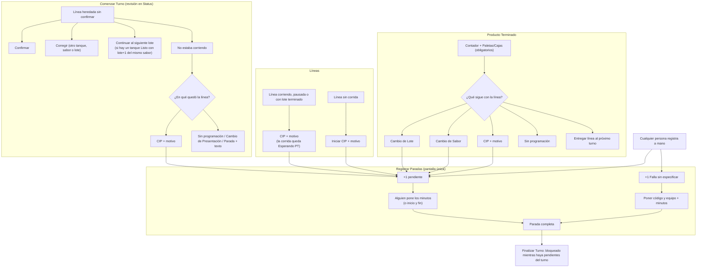

# Plan: Líneas, Producto Terminado y Paradas conectados

Documento vivo. Creado el 2026-09-30. Rama: `lineas-cip-paradas`.

Cómo funciona hoy y problemas encontrados: `docs/flujos-lineas-y-producto-terminado.md`.

**Estado (2026-09-30):**

- [x] Paso 1, arreglos pequeños (F). En producción.
- [x] Paso 2, Paradas (P): código listo en la rama. Falta correr
  `scripts/ensayo-20261090-paradas.sql` en producción y, si termina en
  "ENSAYO OK", `db push` y desplegar.
  - Cambio respecto del diseño: el tiempo ocioso sigue siendo texto libre
    (el catálogo no tiene tipos de ocioso); en la pantalla se elige "Parada
    del catálogo" o "Tiempo ocioso".
  - La guarda de paradas pendientes en `finalizar_turno` aplica también al
    Área de Pruebas, para poder probarla.
- [ ] Paso 3, Líneas (G, H, C, A, B).
- [ ] Paso 4, Producto Terminado (D).
- [ ] Paso 5, Panel, manual.

## Objetivo

Agilizar e interconectar:

1. **Una sola pantalla de paradas** para todo el mundo.
2. Cada parada se registra como **+1** y el supervisor pone después los
   **minutos reales**. No se asume que cada Cambio de Lote dura 10 min.
3. Elegir CIP, Cambio de Lote o Cambio de Sabor en Líneas o en Producto
   Terminado **suma el +1 solo**, y el estado de la línea se ve en el Panel
   de Producción.

## Decisiones tomadas

| Tema | Decisión |
|---|---|
| Pantallas de paradas | Se elimina "Registrar Paradas" (supervisor). Queda una sola, basada en "Paradas de Mantenimiento" |
| Quién registra | Todos. Con todos los tipos: operacionales, programadas, LNPE, equipos, ocioso |
| Cómo se registra | +1 pendiente, sin minutos. Las horas de inicio y fin son **opcionales**: quien las sepa las pone y la parada queda completa |
| Quién completa una pendiente | Cualquiera que pueda registrar paradas |
| Falla sin especificar | +1 pendiente. Al completarla hay que poner el código y el equipo |
| Finalizar turno con pendientes | **Bloqueado** hasta completarlas |
| Línea heredada que no corría | Se quita del turno **sin PT** |
| Motivos del CIP | Falla en Suministro Eléctrico, 36 h de trabajo, falla mecánica prolongada |
| Cerrar una corrida en PT | Exige **PT y Contador**. El Contador no se pide si la corrida ya tenía uno |
| Motivo del CIP al cambiar de turno | No se copia (descartado, no es importante) |
| Paradas repetidas | Antes de un +1 nuevo, se pide cuánto tardó el anterior igual pendiente. "Es un error" no guarda el nuevo |
| Cambio de Lote | Si hay un tanque Listo con el lote siguiente, la línea sigue sola |
| Descripción en el Panel | El supervisor escribe una descripción breve en cada cambio de estado de la línea |

### +1 automático según lo que se elige

| Lo que elige el supervisor | Parada +1 |
|---|---|
| CIP por Falla en Suministro Eléctrico | Falla en Suministro Eléctrico (`FALLA_SUMINISTRO_ELECTRICO`) |
| CIP por 36 h de trabajo | Limpieza Intermedia Programada (`LIMPIEZA_INTERMEDIA`) |
| CIP por falla mecánica prolongada | Falla sin especificar (tipo nuevo) |
| Cambio de Lote | Cambio de Lote (`CAMBIO_LOTE`) |
| Cambio de Sabor | Cambio de Sabor (`CAMBIO_SABOR`) |

---

## Diseño

### Flujo completo

### P. Paradas: pantalla única y +1

**Cómo se guarda una parada pendiente.** Hoy `fin` vacío significa "en curso"
y los reportes cuentan esos minutos hasta ahora. Por eso una pendiente **no**
puede usar `fin` vacío. Diseño:

- Columna nueva `paradas.pendiente boolean not null default false`.
- Una pendiente se guarda con `inicio = fin = hora del +1`. Todos los reportes
  que ya existen la ven como **0 min y 1 vez** (cuenta la frecuencia, no
  suma tiempo) sin tocarlos.
- Se asocia al **turno abierto del área** en ese momento (`turno_id`), para
  saber qué turno debe completarla.

**Completar una pendiente** (función nueva `completar_parada`):

- Con **minutos**: `inicio` = hora del +1, `fin` = inicio + minutos. Si eso
  cae en el futuro, se ancla al revés: `fin` = ahora, `inicio` = ahora − minutos.
- Con **inicio y fin** reales, si se conocen.
- Programada que supera su tiempo guía: pide justificación, como hoy.
- Falla sin especificar: exige elegir el tipo de falla (con su equipo) del
  catálogo. La parada cambia a ese tipo.
- Queda en Auditoría. `pendiente = false`.
- Se puede completar aunque el turno ya esté cerrado (por ejemplo, si el
  sistema lo cerró solo al abrir el siguiente).

**Registrar** (se reemplaza `registrar_parada_mantenimiento`, misma firma más
lo nuevo):

- Sin inicio → +1 pendiente.
- Con inicio y sin fin → **en curso**, como hoy en Mantenimiento.
- Con inicio y fin → completa.
- Se quita la regla "esa parada la registra el supervisor": todos registran
  todo. Se mantiene "Esa parada no aplica a esta línea".
- Tiempo ocioso: también se registra aquí (hoy solo en la pantalla del
  supervisor), con su texto obligatorio.
- **Paradas repetidas:** la misma parada puede ocurrir varias veces (por eso
  cuenta la frecuencia). Si se registra un +1 en una línea y ya hay uno
  **pendiente del mismo tipo** en esa línea, antes de guardar se pregunta
  **cuánto tardó el anterior**:
  - Se escriben los minutos del anterior → se completa el anterior y se
    guarda el nuevo +1.
  - "Es un error" → **no se guarda** el nuevo +1. El anterior queda como
    estaba.
  - El servidor aplica la misma regla: rechaza un +1 si hay otro pendiente
    igual en la línea. Esto también evita el doble clic.
  - Los +1 automáticos (Líneas y PT) siguen la misma regla: si hay uno
    pendiente igual, la pantalla pide primero los minutos del anterior.
- La regla de "no solaparse" queda solo para paradas con horas reales.

**Permiso:** entra quien tenga `PARADAS_REGISTRAR` **o** `PARADAS_MANTENIMIENTO`.

**Pantalla:** es la que hoy se llama **"Paradas de Mantenimiento"**
(`ParadasMantenimiento.tsx`), abierta a todos. Queda en `/paradas`:

- Nueva parada: línea, tipo (incluye "Falla sin especificar"), horas
  opcionales, detalle. Botón "+1" (o "Guardar" si tiene horas).
- **Pendientes** arriba: minutos (o inicio y fin), y tipo si es Falla sin
  especificar.
- En curso, y las últimas 30 días, como hoy.
- `/paradas-mantenimiento` redirige a `/paradas`. Se quita la tarjeta vieja
  del menú.
- `RegistroParadas.tsx` deja de usarse como pantalla. Se conserva
  `AutocompleteTipo`, que ya usa la de Mantenimiento.

**Catálogo:** tipo nuevo `FALLA_SIN_ESPECIFICAR` ("Falla sin especificar"),
clase No programada. No aplica a una planilla hasta completarse.

**Finalizar turno:** `finalizar_turno` rechaza si hay paradas pendientes de
ese turno: "Hay N paradas sin minutos. Complétalas en Registrar Paradas."
Finalizar Turno muestra la lista antes de intentar.

**Paradas registradas antes:** las del supervisor (con minutos) y las de
Mantenimiento siguen igual en todos los reportes.

### A. "No estaba corriendo" (Comenzar Turno)

Función nueva `quitar_corrida_heredada(usuario, turno, corrida, condicion, motivo)`.

- **Borra** la copia de la corrida en el turno nuevo. La original sigue en el
  turno anterior, sin cambios.
  - Por qué borrar y no cerrar: `eficienciaDelTurno` (`src/lib/eficiencia.ts`)
    cuenta cualquier corrida del turno. Una corrida cerrada sin producción
    haría ver la línea como ineficiente.
  - Es seguro: solo `contadores` y `producto_terminado` apuntan a una corrida
    sin borrado en cascada, y la función exige que no tenga ninguno.
- Solo se permite si la corrida está activa, **sin confirmar**, es heredada
  (`activada_en` anterior al inicio del turno) y no tiene Contador ni PT.
- Pone la línea en la condición elegida. Si es CIP, suma el +1 del motivo.
- Revisa si el lote quedó sin corridas y en 0 L (`revisar_cierre_de_lote`).
- Deja registro en Auditoría.

### B. "Continuar al siguiente lote" en la revisión de Comenzar Turno

Ejemplo: la línea tenía el lote 4 y el lote 5 ya está Listo en un tanque.

- Aparece solo si hay **un** tanque Listo con lote+1 del mismo sabor.
- Usa `activar_linea` en modo Status (reemplaza la corrida heredada), con la
  misma presentación y velocidad, y el tanque del lote+1.
- Ayuda en pantalla: "Úsalo si el lote 4 ya se había terminado en el turno
  anterior". Si el lote 4 siguió corriendo en este turno, se usa el flujo
  normal (que pide su PT).

**Arreglo relacionado (problema 8):** cuando `activar_linea` reemplaza una
corrida heredada (Corregir o Continuar), la **borra** si no tiene Contador ni
PT, en vez de dejarla cerrada.

### G. Descripción breve de la línea en el Panel

- Cada vez que la línea cambia de estado (CIP, Parada, Cambio de Sabor, Sin
  programación, Cambio de Presentación), el supervisor escribe una
  **descripción breve** a mano (máx. 140 caracteres). En CIP es **opcional**,
  porque ya está el motivo.
- Se guarda en `lineas_estado.observacion` para **todas** las condiciones
  (hoy solo se guarda para Parada).
- El Panel de Producción la muestra en **todos** los estados de la línea, no
  solo en Parada. `src/pages/apps/PanelProduccion.tsx:219`.

### H. Parada con la línea corriendo (reemplaza a "Parada Operacional")

Una línea puede parar un rato por algo que no es CIP (ejemplo: 20 min por un
atasco) y seguir con la misma corrida.

- Línea corriendo → botón **Agregar parada**: solo la **descripción breve**
  (obligatoria). Sin catálogo en Líneas.
- Suma un **+1 "Parada por clasificar"** en Registrar Paradas y deja la corrida
  en pausa (como hoy `pausar_linea`). La línea se ve **"Parada"** con la
  descripción en Líneas y en el Panel de Producción.
- Botón **"Ir a Registrar Paradas"**: abre esa parada ya desplegada. Ahí se
  elige el tipo en el catálogo y se ponen los minutos. Se ofrece "Usar N min"
  con el tiempo pasado desde el +1.
- **Buscador del catálogo:** no muestra nada hasta que se escribe; como máximo
  8 resultados, agrupados por familia. Ignora tildes y mayúsculas, y acepta
  varias palabras en cualquier orden ("logistica", "cambio sabor", "a3f").
- **Registrar Paradas, compacto:** cada pendiente es una sola fila (línea,
  descripción, hora, "Detiene la línea" si corresponde) con un botón
  **Completar**; el formulario se abre solo en esa fila. "Anotar otra parada"
  y "Completas del turno" quedan plegados.
- **Producto Terminado con la línea parada:** si falta completar la parada, el
  botón lleva a Registrar Paradas; si ya está completa, a Líneas.
- **La línea no puede continuar hasta completar esa parada.** Misma regla para
  "Terminó CIP" (parada del CIP) y para "Arrancar línea" después de un Cambio
  de Sabor o de Lote sin tanque listo.
- Desde la línea parada también se puede **pasar a CIP**. La parada anterior
  sigue pendiente y se suma la del CIP.
- Mientras la línea está parada, Producto Terminado no deja cerrar la corrida
  (como hoy): primero se continúa o se pasa a CIP.
- Base de datos: `pausar_linea` recibe el tipo y crea el +1 en la misma
  transacción; `continuar_linea` recibe los minutos (opcionales) y completa esa
  parada. La parada queda ligada a la corrida (`paradas.turno_linea_id`).

### C. CIP con motivo

- **Línea sin corrida:** "Iniciar CIP" pide el motivo. `cambiar_condicion_linea`
  guarda el texto también para CIP (hoy solo para Parada) y suma el +1.
- **Línea corriendo, pausada o con lote terminado:** botón nuevo "CIP", con
  motivo y doble confirmación. Pregunta **"¿El lote sigue después del CIP?"**
  (ejemplo: se fue la luz y luego se continúa el mismo lote):
  - **Sí, sigue:** la corrida queda **abierta y en pausa** (no pide PT a mitad
    del lote) y la línea queda "En CIP". Al terminar: botón **"Terminó CIP:
    continuar el Lote X"**, que reanuda la misma corrida. Mientras tanto hay un
    botón **"El lote ya no sigue"**, que la pasa a Esperando PT.
  - **No, termina aquí:** la corrida queda Esperando PT, como con Detener línea.
  - Función nueva `detener_linea_a_cip(usuario, turno, corrida, motivo, lote_sigue)`.
    En ambos casos deja la línea en CIP y suma el +1 en la misma transacción.
  - Terminar el CIP exige completar su parada, como el resto (sección H).
- **Motivos, tal como se muestran:** "Falla en Suministro Eléctrico", "36 h de
  trabajo" y "Falla mecánica prolongada".
- **Formularios paso a paso:** se muestra una sola pregunta a la vez. Al
  responder, las opciones desaparecen y queda una línea con lo elegido
  ("Motivo: Falla en Suministro Eléctrico"); después aparece la siguiente
  pregunta. Orden: motivo → "¿El lote sigue?" (si hay corrida) → descripción y
  botón. Si hubo un error, **Cancelar** borra lo respondido y se empieza de
  nuevo. Igual en Comenzar Turno ("No estaba corriendo": primero en qué quedó
  la línea), Líneas y Producto Terminado ("¿Qué sigue?"; ahí Cancelar no borra
  el Contador ni el PT escritos).
- **Panel de Producción:** muestra el motivo también con la línea en CIP
  (hoy solo con Parada). `src/pages/apps/PanelProduccion.tsx:219`.

### D. Producto Terminado: un solo paso y "¿Qué sigue?"

Función nueva `cerrar_corrida(...)`. En **una sola transacción**, reutilizando
las funciones que ya existen:

1. Paso de corrida: `terminar_sabor_linea`, salvo en Cambio de Lote con un
   tanque Listo del lote+1, donde se usa `continuar_siguiente_lote`.
2. `registrar_contador`.
3. `registrar_producto_terminado`.
4. Estado siguiente de la línea y el +1:

| Opción | Estado de la línea | +1 |
|---|---|---|
| Cambio de Lote | Si hay **un** tanque Listo con lote+1 del mismo sabor: sigue sola con ese lote (misma presentación y velocidad). Si no: Parada, hasta arrancarla en Líneas | Cambio de Lote |
| Cambio de Sabor | Parada "Cambio de Sabor" + descripción del supervisor, hasta arrancarla con el sabor nuevo | Cambio de Sabor |
| CIP + motivo | En CIP, con el motivo | Según el motivo |
| Sin programación | Sin programación | — |
| Entregar línea | Sigue corriendo (`entregar_corrida`) | — |

- Si algo falla, **no se guarda nada**: el Contador no se duplica al
  reintentar (problema 2).
- Exige PT y Contador (salvo que la corrida ya tenga Contador). Ya no se
  cierra una corrida sin PT ni sin Contador (problema 1).
- Después de guardar, el aviso de **medir el tanque** vive a nivel de página,
  no dentro de la tarjeta, para que no se pierda (problema 4).
- Modo gracia y modo corrección (solo PT) siguen como hoy.

### F. Arreglos pequeños

- Mensaje de error real en vez de "Intenta de nuevo" (problema 3):
  `src/lib/productoTerminado.ts`, `src/lib/produccion/nucleo.ts`, `ajustes.ts`.
- "Preparación" → "Líneas" en `ProductoTerminado.tsx` (problema 5).
- Tarjeta de Líneas: avisar si hay una corrida Esperando PT aunque haya otra
  activa (problema 7).

---

## Archivos

| Archivo | Cambio |
|---|---|
| `supabase/migrations/20261090090000_paradas_pantalla_unica.sql` | `paradas.pendiente`, tipo `FALLA_SIN_ESPECIFICAR`, registrar (nueva versión), `completar_parada`, `listar_paradas` devuelve `pendiente`, `finalizar_turno` bloquea pendientes |
| `supabase/migrations/20261091090000_lineas_cip_y_cierre_corrida.sql` | `quitar_corrida_heredada`, `detener_linea_a_cip`, `cerrar_corrida`, `cambiar_condicion_linea` (motivo y +1 en CIP), `activar_linea` (borra la heredada sin producción) |
| `scripts/test-paradas-pantalla-unica.sql`, `scripts/test-lineas-cip-y-cierre-corrida.sql` | Pruebas SQL, mismo estilo que los otros `scripts/test-*.sql` |
| `src/lib/paradas.ts` (+ test) | `pendiente` en `Parada`, completar, registrar |
| `src/pages/apps/ParadasMantenimiento.tsx` → pantalla única | Pendientes, +1, ocioso, Falla sin especificar |
| `src/App.tsx`, `src/lib/apps.tsx` | Una sola tarjeta y ruta; redirección |
| `src/pages/apps/FinalizarTurno.tsx` | Lista de pendientes |
| `src/lib/produccion/*` (+ `siguienteLote.ts` y su test) | Funciones nuevas, errores reales, lote+1 |
| `src/components/LineasEstadoPlanta.tsx` | Revisión de inicio, CIP con motivo, aviso Esperando PT |
| `src/pages/apps/ProductoTerminado.tsx` | "¿Qué sigue?", un solo paso, PT y Contador obligatorios, aviso de medir tanque |
| `src/pages/apps/PanelProduccion.tsx` | Motivo del CIP |
| `manual-de-usuario.md`, `MAPA.md` | Pantallas nuevas |

## Orden de trabajo

1. Arreglos pequeños (F). Sin base de datos.
2. Paradas: migración, pruebas SQL, pantalla única, Finalizar Turno (P).
3. Líneas: migración, pruebas SQL, descripción breve (G), Parada y Continuar
   (H), CIP con motivo (C), revisión de inicio (A, B).
4. Producto Terminado (D).
5. Panel, manual y MAPA.

En cada paso: `npm test`, `npx tsc -b`, `npm run lint`. Las migraciones y la
app se prueban en la PC con Docker, en el Área de Pruebas, antes de producción.

**Ojo al desplegar:** las migraciones cambian funciones que usa la app. Hay
que subir la migración y la app nueva juntas, y pedir a quien tenga la app
abierta que recargue.

---

## Para después

- **Paradas pendientes de un turno que el sistema cerró solo:** decidir si el
  turno siguiente las ve y si le bloquean el cierre. Por ahora solo bloquean
  al turno al que pertenecen.
